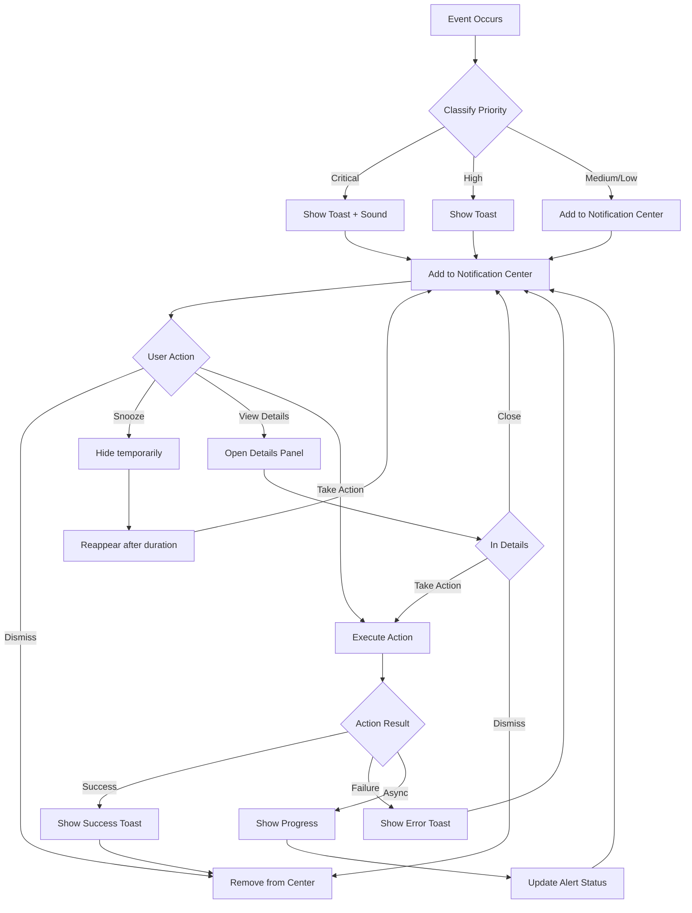

# Mission Control — Alert Interaction Patterns

> **Work Item:** `dgarson/clawdbot#bs-ux-4-alerts`  
> **Related:** `mission-control-alerts-spec.md`, `mission-control-alerts-components.md`

---

## Overview

This document defines user interaction patterns and flows for the Mission Control alert and notification system, ensuring consistent, intuitive, and accessible experiences across all touchpoints.

---

## Core Interaction Patterns

### 1. Alert Lifecycle Flow



---

### 2. Opening the Notification Center

**Entry Points:**

1. **Notification Bell Icon** (Primary)
   - Location: Top navigation bar
   - Badge: Shows unread count (max: "99+")
   - Click → Opens notification center drawer
   - Keyboard: `Ctrl+Shift+N` (desktop)

2. **Alert Toast** (Secondary)
   - Click "View" button → Opens notification center
   - Click alert title → Opens details directly

3. **Keyboard Shortcut** (Power Users)
   - `Ctrl+Shift+N` → Toggle notification center
   - `Escape` → Close notification center

**Flow:**

```
User clicks notification bell
     ↓
Drawer slides in from right
     ↓
Focus moves to notification list
     ↓
First unread alert receives focus
     ↓
Screen reader announces: "Notification center, N unread alerts"
```

**Accessibility:**

- Focus trap within drawer when open
- `Escape` key closes drawer
- Focus returns to trigger element on close
- ARIA: `role="dialog"` with `aria-label="Notifications"`

---

### 3. Viewing & Scanning Alerts

**Pattern: Progressive Disclosure**

```
Alert List View (Summary)
     ↓ Click alert or "View Details"
Alert Details View (Full Context)
     ↓ Click "View Related Events"
Related Events Timeline
```

**Scanning Behavior:**

1. **Visual Hierarchy**
   - Critical alerts always at top
   - Unread alerts highlighted (bold title)
   - Grouped alerts show count badge
   - Timestamp provides temporal context

2. **Information Density**
   - Title: Essential info (what happened)
   - Message: Brief context (why it matters)
   - Metadata: Optional details (source, affected entities)
   - Actions: Most common actions visible

3. **Quick Scan Support**
   - Priority badges enable rapid scanning
   - Color coding conveys urgency
   - Icon + text reinforces meaning
   - Relative timestamps ("2 min ago")

**Keyboard Navigation:**

```
Tab → Move between alerts
Enter/Space → Expand alert or view details
Arrow Up/Down → Navigate within alert list
Escape → Close details/return to list
```

---

### 4. Taking Action on Alerts

**Action Types:**

| Type            | Behavior                    | Confirmation |
| --------------- | --------------------------- | ------------ |
| **Safe**        | Immediate execution         | None         |
| **Destructive** | Show confirmation dialog    | Required     |
| **Async**       | Show progress indicator     | Optional     |
| **Navigation**  | Navigate to relevant screen | None         |

**Safe Actions (No Confirmation):**

- View logs
- View session
- View device
- Dismiss
- Snooze

**Destructive Actions (Require Confirmation):**

- Restart gateway
- Disable channel
- Block IP
- Delete session

**Async Actions (Show Progress):**

- Retry connection
- Throttle requests
- Send report
- Upgrade plan

**Example Flow - Restart Gateway:**

```
User clicks "Restart Gateway" (destructive action)
     ↓
Confirmation dialog appears:
┌─────────────────────────────────────────┐
│ ⚠️  Confirm Gateway Restart             │
│ ━━━━━━━━━━━━━━━━━━━━━━━━━━━━━━━━━━━━━ │
│                                         │
│ This will disconnect all active        │
│ sessions and may take up to 30 seconds. │
│                                         │
│   Active sessions: 5                   │
│   Active channels: 3                   │
│                                         │
│         [Cancel]  [Restart Anyway]     │
└─────────────────────────────────────────┘
     ↓
User confirms
     ↓
Progress indicator appears:
┌─────────────────────────────────────────┐
│ 🔄 Restarting Gateway...                │
│ ━━━━━━━━━━━━━━━━━━━━━━━━━━━━━━━━━━━━━ │
│ ████████████░░░░░░░░░░░░  50%          │
│                                         │
│ Stopping active sessions...             │
└─────────────────────────────────────────┘
     ↓
Success toast:
┌─────────────────────────────────────────┐
│ ✅ Gateway restarted successfully       │
│ Downtime: 28 seconds                    │
└─────────────────────────────────────────┘
```

**Action Feedback:**

- Success: Green toast with checkmark icon
- Failure: Red toast with error icon + retry option
- Progress: Inline spinner + percentage (if available)

---

### 5. Snoozing Alerts

**Purpose:** Temporarily hide non-critical alerts to reduce clutter

**Snooze Flow:**

```
User clicks "Snooze" on alert
     ↓
Snooze duration picker appears:
┌─────────────────────────────┐
│ Snooze for:                 │
│ ━━━━━━━━━━━━━━━━━━━━━━━━━ │
│ • 5 minutes                │
│ • 15 minutes               │
│ • 30 minutes               │
│ • 1 hour                   │
│ • Custom...                │
└─────────────────────────────┘
     ↓
User selects duration
     ↓
Alert disappears with animation
     ↓
Confirmation toast:
┌─────────────────────────────────────────┐
│ ⏰ Alert snoozed for 15 minutes         │
│ [Undo]                                  │
└─────────────────────────────────────────┘
     ↓
After duration expires:
Alert reappears at top of list with "Snoozed" badge
```

**Snooze Restrictions:**

- P0 (Critical): Cannot be snoozed
- P1 (High): Max 30 minutes
- P2 (Medium): Max 1 hour
- P3 (Low): Max 4 hours

**Unsnoozing:**

- Click "Undo" in toast (within 5 seconds)
- Go to Settings > Snoozed Alerts > Cancel

---

### 6. Dismissing Alerts

**Single Alert Dismissal:**

```
User clicks "Dismiss" (✕) on alert
     ↓
Alert animates out (slide left + fade)
     ↓
Alert removed from list
     ↓
List updates (no empty space)
```

**Bulk Dismissal:**

```
User clicks "Dismiss All" in group
     ↓
Confirmation dialog:
┌─────────────────────────────────────────┐
│ Dismiss 3 alerts?                       │
│ ━━━━━━━━━━━━━━━━━━━━━━━━━━━━━━━━━━━━━ │
│ This will dismiss all alerts in the    │
│ "Connection Issues" group.              │
│                                         │
│         [Cancel]  [Dismiss All]        │
└─────────────────────────────────────────┘
     ↓
All alerts in group animate out
     ↓
Group removed from list
```

**Mark as Read (Alternative to Dismiss):**

```
User clicks "Mark as Read" on alert
     ↓
Unread badge removed
Alert remains in list (dimmed)
Timestamp updated
```

**Undo Dismissal:**

- Toast with "Undo" button appears for 5 seconds
- Click "Undo" → Alert restored to list

---

### 7. Filtering & Searching

**Filter Controls:**

```
┌───────────────────────────────────────────────────────────┐
│ [All] [Critical] [High] [Medium] [Low]     [⚙ Settings]  │
│ ━━━━━━━━━━━━━━━━━━━━━━━━━━━━━━━━━━━━━━━━━━━━━━━━━━━━━━━ │
│ 🔍 Search notifications...                                │
└───────────────────────────────────────────────────────────┘
```

**Filter Flow:**

```
User clicks filter pill (e.g., "Critical")
     ↓
List updates to show only critical alerts
     ↓
Filter pill becomes active (bold + underline)
     ↓
URL updates: ?filter=critical
     ↓
Count updates: "3 critical alerts"
```

**Search Flow:**

```
User types in search box
     ↓
Real-time filtering (debounced 300ms)
     ↓
Search against:
  • Alert title
  • Message
  • Source
  • Category
     ↓
Results highlighted:
  ┌─────────────────────────────────────────┐
  │ 🔴 Gateway process crashed              │
  │ Process ==crashed== with code 1         │
  └─────────────────────────────────────────┘
     ↓
No results state:
  ┌─────────────────────────────────────────┐
  │ 🔍 No results for "crashed"            │
  │                                         │
  │ Try searching for:                      │
  │ • error                                 │
  │ • timeout                               │
  │ • connection                            │
  └─────────────────────────────────────────┘
```

---

### 8. Grouping & Aggregation

**Grouping Options:**

- **Time**: Last hour, today, yesterday, older
- **Category**: System, channel, agent, session, security
- **Source**: WhatsApp, Telegram, Discord, etc.
- **None**: Flat list (ungrouped)

**Grouping Flow:**

```
User selects "Group by Category" in settings
     ↓
List reorganizes:
  ┌─────────────────────────────────────────┐
  │ 🔴 System (2)                           │
  │   • Gateway process crashed             │
  │   • Memory warning                      │
  ├─────────────────────────────────────────┤
  │ 🟡 Channel (3)                          │
  │   • WhatsApp disconnected               │
  │   • Telegram reconnected                │
  │   • Discord rate limited                │
  ├─────────────────────────────────────────┤
  │ 🔵 Session (1)                          │
  │   • Session started                     │
  └─────────────────────────────────────────┘
```

**Expand/Collapse Groups:**

```
User clicks group header
     ↓
Group toggles:
  • Expanded: Show all alerts
  • Collapsed: Show summary + count
     ↓
State persists in localStorage
```

---

### 9. Toast Notifications

**Toast Appearance:**

```
New alert arrives while user is active
     ↓
Toast slides in from top-right (desktop) or bottom (mobile)
     ↓
Toast displays:
  • Priority badge
  • Alert title
  • Brief message (1 line max)
  • "View" button
  • "Dismiss" button
     ↓
Auto-dismiss timer starts:
  • Critical: Never
  • High: 10 seconds
  • Medium: 7 seconds
  • Low: 5 seconds
     ↓
Toast animates out (slide + fade)
```

**Toast Stacking:**

```
Multiple toasts arrive simultaneously
     ↓
Stack from top (newest at top):
  ┌────────────────────────────────┐
  │ 🔴 Critical Alert 1       [✕] │
  └────────────────────────────────┘
  ┌────────────────────────────────┐
  │ 🟠 High Alert 2           [✕] │
  └────────────────────────────────┘
  ┌────────────────────────────────┐
  │ 🔵 Low Alert 3            [✕] │
  └────────────────────────────────┘
     ↓
Max 3 toasts visible at once
Older toasts auto-dismiss
```

**Toast Interactions:**

- Click "View" → Open notification center (filtered to this alert)
- Click "Dismiss" → Remove toast immediately
- Click alert title → Open details panel
- Hover (desktop) → Pause auto-dismiss timer

---

### 10. Sound & Haptic Feedback

**Sound Playback Flow:**

```
Alert classified as priority P
     ↓
Check sound settings:
  • Sounds enabled?
  • Quiet hours active?
  • Critical override allowed?
     ↓
If sound allowed:
  Preload sound if not cached
     ↓
  Play sound at configured volume
     ↓
  Sound completes
```

**Sound Configuration:**

```
Settings > Sounds & Haptics
     ↓
User adjusts volume slider
     ↓
Real-time preview: play sample sound
     ↓
User clicks "Test" buttons
     ↓
Play each priority sound
```

**Haptic Feedback (Mobile):**

```
Alert arrives on mobile device
     ↓
Check haptic settings:
  • Haptics enabled?
  • Device supports haptics?
     ↓
If haptics allowed:
  Trigger haptic pattern:
    • Critical: Heavy, 3 pulses
    • High: Medium, 2 pulses
    • Medium: Light, 1 pulse
    • Low: None
```

---

### 11. Accessibility Patterns

**Screen Reader Support:**

**Alert Announcement:**

```
Alert arrives
     ↓
Screen reader announces:
  "Critical alert: Gateway process crashed.
   Process exited with code 1.
   Actions available: View Logs, Restart Gateway, Dismiss."
```

**Live Region Updates:**

```html
<div role="log" aria-live="polite" aria-atomic="true">
  <!-- New alerts appended here -->
</div>
```

**Keyboard Navigation:**

```
Tab → Navigate between alerts
Enter → View details or expand group
Space → Toggle selection (bulk actions)
Escape → Close drawer/details
Arrow Up/Down → Navigate within list
Home → Jump to first alert
End → Jump to last alert
Delete → Dismiss focused alert
```

**High Contrast Mode:**

- All priority colors have high-contrast alternatives
- Icons use distinct shapes (not just color)
- Focus indicators visible at all times
- Text meets WCAG AAA contrast ratios (7:1)

---

### 12. Offline & Error States

**Offline Detection:**

```
WebSocket disconnects
     ↓
Offline indicator appears:
┌─────────────────────────────────────────┐
│ ⚠️  Connection lost                     │
│ Attempting to reconnect...              │
│ [Retry Now]                             │
└─────────────────────────────────────────┘
     ↓
Existing alerts remain visible (cached)
     ↓
New alerts queued locally
     ↓
Connection restored
     ↓
Sync queued alerts
     ↓
Offline indicator dismissed
```

**Error Handling:**

```
Action fails (e.g., restart gateway)
     ↓
Error toast appears:
┌─────────────────────────────────────────┐
│ ❌ Failed to restart gateway            │
│ Error: Permission denied                │
│                                         │
│ [Retry] [View Logs] [Dismiss]          │
└─────────────────────────────────────────┘
     ↓
Alert remains in list with updated status
```

**Empty State:**

```
No alerts match current filter
     ↓
Empty state displayed:
┌─────────────────────────────────────────┐
│ 🔔                                      │
│                                         │
│ No notifications                         │
│                                         │
│ You're all caught up!                    │
│                                         │
│ [View All Alerts]                        │
└─────────────────────────────────────────┘
```

---

## Edge Cases & Error Scenarios

### 1. High-Volume Alert Storm

**Scenario:** 100+ alerts arrive in 1 minute (e.g., DDoS attack)

**Handling:**

1. Rate limiting kicks in (max 10 toasts per minute)
2. Alerts auto-grouped by source
3. Summary toast: "98 similar alerts"
4. Notification center shows all, but virtualized
5. User can "Pause Notifications" for 1 hour

### 2. Conflicting Actions

**Scenario:** User tries to restart gateway while it's already restarting

**Handling:**

```
User clicks "Restart Gateway" again
     ↓
Action disabled with tooltip:
  "Gateway restart already in progress"
     ↓
Progress indicator shows current state
```

### 3. Stale Data

**Scenario:** Alert refers to entity that no longer exists (e.g., deleted session)

**Handling:**

```
User clicks "View Session"
     ↓
Session no longer exists
     ↓
Error state in details panel:
┌─────────────────────────────────────────┐
│ ⚠️  Session not found                   │
│                                         │
│ This session has been terminated or    │
│ deleted.                                │
│                                         │
│ [Dismiss Alert]                         │
└─────────────────────────────────────────┘
```

### 4. Network Latency

**Scenario:** Action takes > 5 seconds to complete

**Handling:**

```
Action in progress
     ↓
After 5 seconds, show extended progress:
┌─────────────────────────────────────────┐
│ 🔄 Restarting Gateway...                │
│                                         │
│ This is taking longer than expected.    │
│                                         │
│ [Cancel]                                │
└─────────────────────────────────────────┘
```

### 5. Browser Background Tab

**Scenario:** Alert arrives while tab is in background

**Handling:**

1. Browser notification (if permission granted)
2. Tab title updates: "(3) Mission Control"
3. Favicon badge shows count
4. On tab focus → Show missed toasts (max 3)

---

## Success Metrics & Monitoring

### User Behavior Tracking

**Track These Events:**

- Alert viewed (impression)
- Alert dismissed (with reason if available)
- Alert snoozed (duration)
- Action taken (which action)
- Details viewed
- Filter changed
- Search performed
- Sound played
- Toast clicked

**Conversion Funnels:**

```
Alert Arrives
  ↓ (100%)
Alert Viewed
  ↓ (85%)
Action Taken
  ↓ (60%)
Action Succeeded
  ↓ (95%)
Alert Dismissed
```

### Performance Metrics

- **Time to First Action**: < 30 seconds (median)
- **Alert Fatigue Rate**: < 10% dismissed without action
- **False Positive Rate**: < 5% marked "not actionable"
- **System Reliability**: > 99.9% alert delivery success
- **UI Responsiveness**: < 100ms interaction latency

---

## Implementation Checklist

- [ ] All interaction patterns implemented and tested
- [ ] Keyboard navigation complete
- [ ] Screen reader support verified
- [ ] High contrast mode tested
- [ ] Offline state handling
- [ ] Error states implemented
- [ ] Edge cases covered
- [ ] Analytics tracking in place
- [ ] Performance monitoring active
- [ ] A/B test infrastructure ready
- [ ] User feedback collection enabled
- [ ] Documentation complete
- [ ] Training materials created

---

## Revision History

| Date       | Version | Author            | Changes                      |
| ---------- | ------- | ----------------- | ---------------------------- |
| 2026-02-23 | 1.0     | Claire (UX Squad) | Initial interaction patterns |
