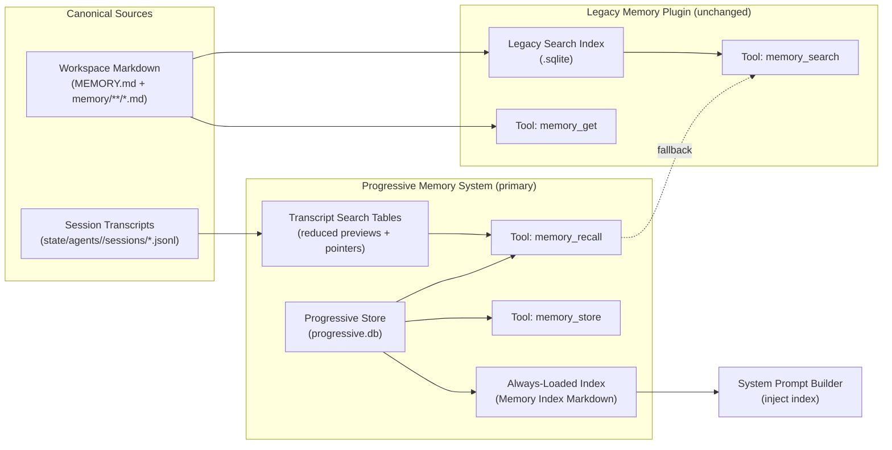
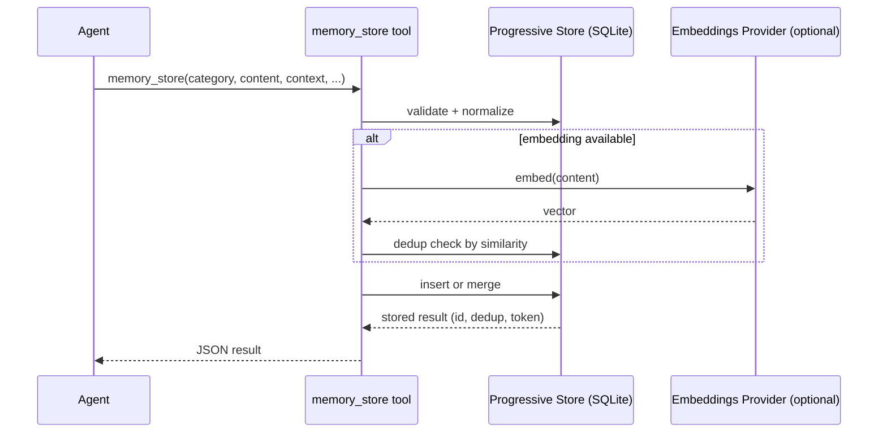
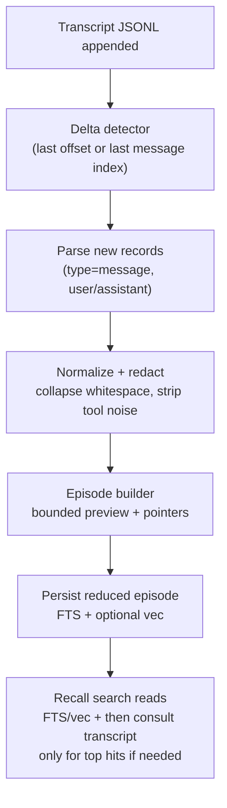
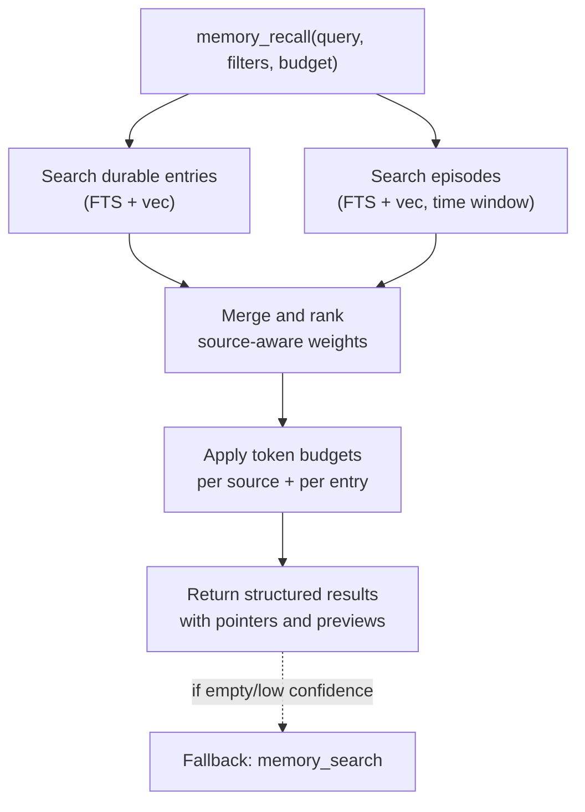

# Progressive Memory System - Design V2

**Author**: Codex (review and redesign)  
**Date**: 2026-02-05  
**Status**: Proposed design (implementation not planned in this doc)

This document is a ground-up redesign of OpenClaw progressive memory based on:

- Existing design: `docs/plans/2026-02-04-progressive-memory-system-design.md`
- Current code shape (legacy memory search + partial progressive modules)
- Operator constraints (from this thread)

## 1. Goals and Constraints

### Goals

1. **Progressive disclosure by default**
   - Keep an always-loaded memory index under a strict token budget.
   - Pull richer detail only on demand.
2. **Durable memory is structured**
   - Write durable facts, preferences, instructions, decisions, and project state into a typed store.
3. **Session transcripts are searchable**
   - Recent conversations should be recallable by semantic and keyword search.
4. **Do not multiply large raw copies of transcripts**
   - Session transcripts remain the canonical record.
   - Any derived persistence must be materially reduced (summaries, hashes, embeddings, short previews).
5. **Graceful degradation**
   - If progressive memory is down, legacy `memory_search` / `memory_get` still work.

### Non-Goals

1. Replacing the legacy memory plugin immediately.
2. Storing "everything said" as durable memory.
3. Building a full knowledge graph in the first pass (design allows it later).

### Hard Constraints

1. **No extra verbose JSON files** that duplicate session transcripts.
2. Derived storage may use SQLite tables and compact Markdown exports.

## 2. Terminology

- **Transcript**: canonical per-session JSONL under the state dir, append-only.
- **Durable memory**: stable, curated knowledge intended to outlive a session.
- **Episode**: a reduced representation of a transcript span (summary + pointers) used for search and recall.
- **Index (always-loaded)**: a compact Markdown section injected into the system prompt.
- **Legacy memory**: file-backed Markdown memory searchable via `memory_search` and `memory_get`.

## 3. High-Level Architecture

### Components

- **Legacy memory search (unchanged)**
  - Sources: workspace Markdown (`MEMORY.md`, `memory/**/*.md`, optional extra paths).
  - Tools: `memory_search`, `memory_get`.
  - Store: per-agent SQLite search index.

- **Progressive memory (new primary path)**
  - Store: structured SQLite database.
  - Tools: `memory_store`, `memory_recall`, `memory_index_status`, `memory_audit`.
  - Always-loaded index: generated from the structured store.

- **Transcript search (part of progressive memory)**
  - Canonical transcripts: JSONL remain in place.
  - Derived data: reduced previews, embeddings, and pointers for fast retrieval.

### Architecture Diagram

## 4. Data Model

### 4.1 Durable Memory Entries

Durable memory is stored as typed entries.

Core fields:

- `id` (uuid)
- `category` (enum)
- `content` (string, Markdown allowed)
- `context` (optional, why it matters)
- `priority` (critical, high, medium, low)
- `tags` (string[])
- `related_to` (string[])
- `source` (manual, session, migration, consolidation)
- `created_at`, `updated_at`
- `expires_at` (optional, enables auto-archive)
- `archived` (bool)
- `token_estimate` (approx)

### 4.2 Episode Records (Transcript-Derived)

To make transcripts searchable without copying them wholesale, store **reduced episode records**:

- `episode_id` (uuid)
- `session_id` (string)
- `session_file` (string, canonical path)
- `range` (message index range or timestamp range)
- `preview` (short normalized text, bounded)
- `summary` (optional short summary, bounded)
- `embedding` (optional vector, derived from `preview` or `summary`)
- `tags` (optional)
- `created_at`
- `token_estimate`

Key rule:

- `preview` and `summary` must be **materially reduced**.
  - Example: max 500-1500 characters per episode, configurable.

### 4.3 Transcript Pointer Strategy

For any transcript recall hit, the result payload should include pointers, not raw dumps:

- `session_id`
- `message_index_start`, `message_index_end` (or `timestamp_ms_start/end`)
- `citation` (for internal traceability; user-facing citation controlled by `memory.citations`)

## 5. Ingestion and Sync

### 5.1 Durable Memory Write Path

`memory_store` is the only "structured write" tool.

- Input: typed fields, optional tags, optional expiry.
- Output: entry id + dedup metadata + token estimate.
- Storage: `progressive.db`.

### 5.2 Transcript Search Ingestion

Transcripts remain canonical and are already being appended by the session system.
Progressive memory should maintain reduced searchable representations.

Trigger points:

- On transcript append events (debounced).
- On session end or compaction boundary (optional summarization).
- On a background interval for catch-up (optional).

Algorithm sketch:

1. Detect transcript deltas (bytes/messages appended).
2. Parse only new JSONL records (`type=message`, role user/assistant).
3. Normalize and redact.
4. Chunk into episodes using a bounded window:
   - Example: every N messages or M characters, whichever comes first.
5. Persist reduced `preview` for each episode and optional embedding.

Important:

- Do not persist raw message bodies beyond the preview budget.
- Keep stable pointers back to the transcript file and message indices.

### 5.3 Summarization Policy (If Enabled)

Summarization is optional. If enabled, it produces compact summaries, not verbose replicas.

- Summaries are stored in SQLite fields.
- No new JSON logs.
- A summary is a reduction, not a transcript reprint.

## 6. Retrieval Design

### 6.1 Always-Loaded Index (System Prompt Injection)

The system prompt should include a compact index derived from progressive memory.

Properties:

- Hard token budget (example target: 1200-1800 tokens).
- Prioritizes critical and high-priority durable memory.
- Includes minimal "how to recall more" hints.
- Includes no transcript dumps.

Recommended structure:

- Critical always-relevant bullets
- Current projects and active constraints
- Pinned preferences and instructions
- "Domains" section listing categories and counts with suggested `memory_recall` calls

### 6.2 memory_recall Behavior

`memory_recall` should be the primary recall tool.

Inputs:

- `query`
- filters: categories, priority, tags
- `token_budget`
- `include_context` (off by default)
- `include_transcripts` (on by default for private sessions, off for groups)
- `time_window` (optional, e.g. last 30d of transcripts)

Outputs:

- Structured entries with per-entry score and minimal content.
- Optional transcript hits as episode pointers with short preview.
- Token accounting.

Retrieval strategy:

1. Query durable memory entries (hybrid FTS + vector).
2. Query episode records (hybrid FTS + vector) with time window.
3. Merge and budget:
   - Allocate budget by source (durable first, episodes second).
4. If results are empty or low confidence:
   - Fallback to legacy `memory_search` for file-backed Markdown.

### 6.3 memory_search Role in V2

Legacy tools remain available and unchanged, but the system prompt guidance should shift:

- Prefer `memory_recall` for most "what do we know" questions.
- Use `memory_search` as a fallback for:
  - Not-yet-migrated Markdown.
  - Rare deep dives into legacy files.

## 7. Integration Points

### 7.1 Tooling Integration

- Tools are registered conditionally when `memory.progressive.enabled = true`.
- `memory_search` and `memory_get` are provided by the memory plugin slot and remain.
- `memory_recall` is expected to call into:
  - progressive durable entry retrieval
  - transcript episode retrieval
  - optional fallback to legacy manager

### 7.1.1 Concrete Code Touchpoints (Current Repo)

This section names the integration seams that exist today and that the V2 design relies on.

- Tool registration
  - `src/agents/openclaw-tools.ts` registers progressive tools conditionally (already present).
  - `extensions/memory-core/index.ts` registers `memory_search` and `memory_get` (legacy).
- System prompt builder
  - `src/agents/system-prompt.ts` already supports `progressiveMemoryIndex?: string` but callers must supply it.
  - `src/agents/pi-embedded-runner/system-prompt.ts` and `src/agents/cli-runner/helpers.ts` are the obvious call sites that would pass the index in.
- Transcript append and events
  - `src/config/sessions/transcript.ts` appends assistant mirror messages and emits transcript updates.
  - `src/sessions/transcript-events.ts` is the event hub for transcript updates and can drive incremental ingestion.
- Legacy manager behavior
  - `src/memory/manager.ts` includes session indexing machinery, but it is gated by config today.
  - V2 transcript search should not require enabling legacy session indexing if progressive owns the episode path.

### 7.2 System Prompt Integration

The system prompt builder needs a reliable way to provide `progressiveMemoryIndex`.

Design:

- Introduce a "memory index provider" step during session startup that resolves:
  1. Cached `memory/MEMORY-INDEX.md` if fresh.
  2. Otherwise, generate from `progressive.db` and cache it.
  3. If progressive is unavailable, omit progressive index and rely on legacy prompt guidance.

### 7.3 Compaction Memory Flush Integration

Current behavior prompts the agent to write durable notes into workspace files prior to compaction.
In the V2 design:

- The flush prompt should prefer `memory_store` (structured) when progressive is enabled.
- If sandboxed read-only, skip.
- If structured store fails, fall back to appending to `memory/YYYY-MM-DD.md`.

### 7.4 CLI and UI Integration

CLI:

- `openclaw memory ...` remains legacy index tooling.
- Add a separate CLI surface for progressive memory status and operations (optional).

Web UI:

- `apps/web` should treat progressive memory as the canonical memory API.
- UI should not assume memory entries are files.

### 7.5 Proposed RPC and UI Contract (Gateway)

The UI should speak in "memory entries" and "episodes", not files.

Minimal contract:

- `memory.list`
  - Filters: `category`, `priority_min`, `tag`, `archived`, `limit`, `cursor`.
- `memory.search`
  - Inputs: `query`, optional filters, `token_budget`, `include_transcripts`, `time_window`.
  - Outputs: same shape as `memory_recall`.
- `memory.create` and `memory.update`
  - Equivalent to `memory_store` semantics, but suitable for UI editing workflows.
- `memory.delete` (soft delete)
  - Prefer archive semantics by default.

V2 does not require this to exist immediately, but designing to this contract prevents the UI from binding to file layouts that will change.

## 8. Operational Concerns

### Performance

- Prefer incremental transcript ingestion.
- Keep episode previews bounded.
- Store embeddings for episodes only if needed.
- Cache index generation and avoid regenerating per turn.

### Privacy and Safety

- Transcript indexing should obey session send policy (private by default).
- Redaction is mandatory for derived previews and summaries.
- Citations should be controlled (`memory.citations`) and typically kept internal.

### Failure Modes

- Embeddings unavailable:
  - Use FTS-only search for entries and episodes.
- FTS unavailable:
  - Use vector-only (if available) or keyword fallback.
- Progressive store unavailable:
  - Fall back to legacy `memory_search`.

## 9. Acceptance Criteria for This Design (Conceptual)

1. Always-loaded index stays under the configured token budget.
2. Transcript search returns useful pointers with short previews, without dumping large transcript text.
3. No new verbose JSON artifacts are created outside canonical session transcript JSONL.
4. `memory_recall` can answer the common "what did we decide" questions without requiring `memory_search`.

## 10. Storage Layout (Proposed)

The V2 design assumes two categories of persisted state.

Canonical:

- State dir transcripts: `~/.openclaw/agents/<agentId>/sessions/*.jsonl`

Derived (reduced):

- Progressive store: `~/.openclaw/memory/progressive.db`
- Optional cached index export (workspace): `<workspace>/memory/MEMORY-INDEX.md`

Rules:

- Do not create additional verbose JSON logs as part of progressive memory.
- Any workspace exports must be compact and bounded (intended for prompt injection and human audit).
