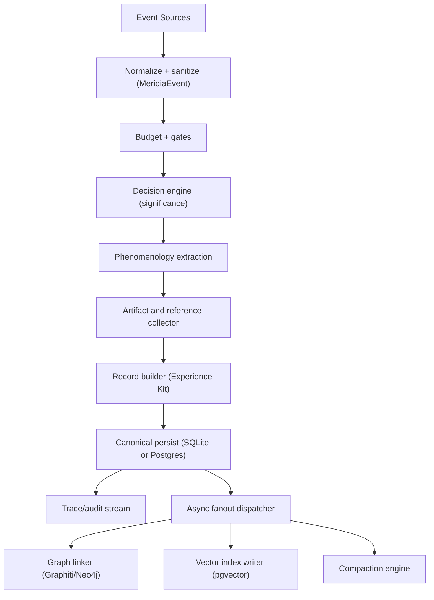
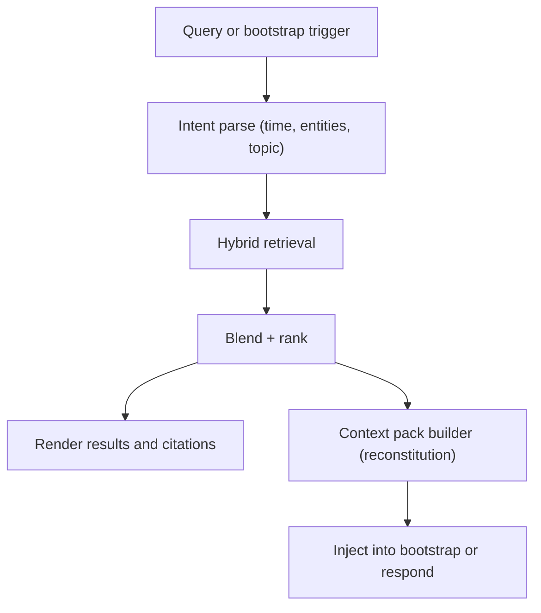

# Meridia Architecture

This document describes Meridia as an **experiential continuity** system: capture what happened, how it felt to be present, and enough references (text + non-text artifacts) to later **reconstitute** a best effort experiential state.

This is an architecture doc, not an implementation guide. See `COMPONENT-MAP.md` for the component inventory and interfaces.

## Goals

- Capture **high signal experiences** across agent activity (tools, messages, lifecycle events).
- Preserve **phenomenology** (emotional signature, engagement quality, anchors, uncertainties, reconstitution hints).
- Persist durable **references for more detail** (files, URLs, media, transcripts, screenshots, diffs).
- Support retrieval for:
  - Search (lexical and semantic)
  - Graph traversal (relationships, causality, co-occurrence)
  - Reconstitution (state approach guidance, not just lists)
- Degrade gracefully when optional dependencies are unavailable.

## Non goals

- Perfect human memory simulation.
- Storing raw secrets or full sensitive payloads by default.
- Blocking the agent loop on expensive enrichment work.

## External dependencies and how Meridia uses them

- SQLite (default): canonical store for records + trace/audit.
- PostgreSQL (optional): durable canonical store and/or vector index (pgvector) when configured.
- Neo4j (via Graphiti service): graph store for entities, relations, and episode linking.
- Filesystem object store: media/artifact storage (images/audio/video/files), referenced from records.

## Core abstraction: Experience Kit

Meridia treats a captured experience as an **Experience Kit**:

- A canonical experience record (structured and searchable)
- A set of artifact references (media, files, links, transcripts, screenshots)
- Provenance (who/what/when/where)
- Optional derived artifacts (OCR, ASR, captions, summaries, embeddings)
- Optional links into graph and vector indices

Experience kits are designed to survive partial failures:

- If graph write fails, SQLite still stores the canonical record.
- If vector index fails, lexical retrieval still works.
- If media saving fails, the record still captures a textual anchor and reference metadata.

## Planes

Meridia is easiest to reason about in two planes.

### Capture plane

Capture receives events, decides whether and how to capture, collects references, persists, then optionally fans out to graph/vector/indexing.

### Retrieval and reconstitution plane

Retrieval blends multiple sources and produces either search results or a reconstitution context pack.

## Lifecycle integration

Meridia integrates via three surfaces:

- Hooks (internal hook system): tool results, bootstrap, compaction, session boundary events.
- Tools (agent tools): manual capture, search, reflect, and later ingest/reconstitute.
- Search backend (core memory): Meridia contributes a memory backend so other parts of OpenClaw can query it.

### Key hook points

- `agent:tool:result` (experiential capture): highest throughput event source.
- `agent:bootstrap` (reconstitution): inject continuity context at session start.
- `agent:precompact` + `agent:compaction:*` (compaction): snapshot pre-compaction state and consolidate experiences.
- `command:new` / `command:stop` (session end): seal a session with summary artifacts.

## Storage layering

Meridia uses polyglot persistence:

- **Canonical store** (SQLite or Postgres): truth for Meridia records, trace events, and queryable filters.
- **Graph store** (Neo4j via Graphiti): relational context (people, topics, causal chains, references).
- **Vector store** (pgvector): semantic similarity for "felt like this" retrieval and clustering.
- **Artifact store** (filesystem): durable references to non-text media and other large payloads.

## Compatibility with core memory pipeline

OpenClaw has a memory ingestion pipeline that already supports:

- Episodes extraction from artifacts (OCR/ASR/caption metadata)
- Entity extraction and graph writes (Graphiti)
- Embedding and vector indexing (adapter based)

Meridia can reuse this pipeline by emitting `MemoryContentObject` items (episodes) derived from Experience Kits, instead of re-implementing extraction/enrichment logic.

## Reliability and safety stance

- Prefer **append-only** canonical record persistence.
- Use explicit **redaction/sanitization** before persistence and before fanout.
- Never rely on best-effort side effects (graph/vector) for correctness.
- Keep a trace stream (DB + optional JSONL) for audit and debugging.

## Suggested next step

Start with a small, correctness oriented foundation:

1. Fix async correctness so every backend call is awaited and initialization is deterministic.
2. Make `meridia://<id>` resolvable so stored experience kits are inspectable.
3. Activate the phenomenology schema (emotions, anchors, uncertainties, hints) in capture and reconstitution.
