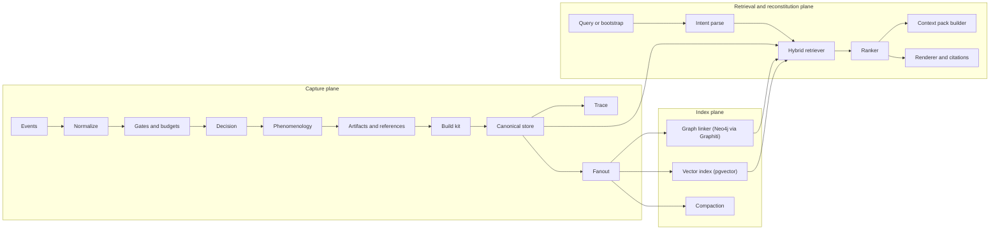

# Meridia Component Map

This document enumerates the proposed Meridia components, their boundaries, contracts, and how they map back to the current codebase.

## How many components are there

Meridia is best modeled as **14 components**:

- **11 core components** (capture, persistence, retrieval, reconstitution)
- **3 cross cutting components** (sanitization, schemas/migrations, observability)

This count is intentional: it is small enough for a long horizon workstream, but explicit enough for parallel agent work without architecture drift.

## Mental model

Meridia is an **Experience Kit system**:

- Capture events into structured experience kits
- Persist and index them across multiple stores
- Retrieve and render them as either search results or reconstitution context



## Component inventory

### Core components (11)

|  ID | Component                        | Primary responsibility                                          | Inputs                           | Outputs                        | Depends on                            |
| --: | -------------------------------- | --------------------------------------------------------------- | -------------------------------- | ------------------------------ | ------------------------------------- |
|   1 | Event Normalizer                 | Convert hook/tool payloads into a typed `MeridiaEvent` envelope | Hook events, tool calls          | `MeridiaEvent`                 | Hook system                           |
|   2 | Gates and Budget Manager         | Apply rate limits and token/storage budgets                     | `MeridiaEvent`, config           | Allow/deny + reasons           | Canonical store (for history), config |
|   3 | Capture Decision Engine          | Decide capture worthiness and capture mode                      | `MeridiaEvent`                   | `CaptureDecision`              | LLM (optional), heuristics            |
|   4 | Phenomenology Extractor          | Produce experiential facets aligned to schema                   | `MeridiaEvent`, decision         | `Phenomenology`                | LLM (optional), templates             |
|   5 | Artifact and Reference Collector | Produce durable references (media, files, links, excerpts)      | `MeridiaEvent`                   | `ArtifactRef[]` + citations    | media store, path allowlists          |
|   6 | Experience Kit Builder           | Assemble canonical `ExperienceKit` record                       | decision + phenom + artifacts    | `ExperienceKit`                | schema/version                        |
|   7 | Canonical Store                  | Persist and query kits and trace events                         | `ExperienceKit`, queries         | `ExperienceKit`, query results | SQLite or Postgres                    |
|   8 | Trace and Audit Stream           | Append trace events for every decision and side effect          | events, decisions                | DB + optional JSONL            | Canonical store, filesystem           |
|   9 | Fanout Dispatcher                | Run async side effects with retries + backpressure              | `ExperienceKit`                  | graph/vector/compaction jobs   | queues, timers                        |
|  10 | Hybrid Retriever and Ranker      | Retrieve across canonical, graph, vector                        | query intent                     | ranked results + citations     | store + Graphiti + pgvector           |
|  11 | Reconstitution Engine            | Build a state approach context pack from results                | ranked results + session context | reconstitution pack            | templates, budgets                    |

### Cross cutting components (3)

|  ID | Component                        | Responsibility                                                      | Used by |
| --: | -------------------------------- | ------------------------------------------------------------------- | ------- |
|  12 | Sanitization and Redaction Guard | Prevent secrets and unsafe payloads from persistence and fanout     | 1-11    |
|  13 | Schemas and Migrations           | Versioned schemas for kits, facets, artifacts, and store migrations | 6-11    |
|  14 | Observability                    | Metrics, structured logs, and debug artifacts (trace, ops logs)     | 1-11    |

## Contracts (interfaces)

The contracts below are the stable integration points that let agents work in parallel.

### MeridiaEvent envelope

```ts
export type MeridiaEventKind =
  | "tool_result"
  | "user_message"
  | "assistant_message"
  | "session_boundary"
  | "manual_capture"
  | "manual_ingest";

export type MeridiaEvent = {
  id: string;
  kind: MeridiaEventKind;
  ts: string;
  session?: { key?: string; id?: string; runId?: string };
  channel?: { id?: string; type?: string };
  tool?: { name?: string; callId?: string; isError?: boolean; meta?: string };
  payload: unknown;
  provenance: {
    source: "hook" | "tool" | "system";
    traceId?: string;
  };
};
```

### CaptureDecision

```ts
export type CaptureDecision = {
  shouldCapture: boolean;
  significance: number; // 0..1
  threshold?: number;
  mode: "full" | "light" | "trace_only";
  reason?: string;
  limited?: { reason: "min_interval" | "max_per_hour" | "budget"; detail?: string };
};
```

### Phenomenology

This maps to the schema in `docs/experiential-engine/schemas/experiential-record.schema.json`.

```ts
export type Phenomenology = {
  emotionalSignature?: {
    primary: string[];
    secondary?: string[];
    intensity: number;
    valence?: number;
    texture?: string;
  };
  engagementQuality?: "deep-flow" | "engaged" | "routine" | "distracted" | "struggling";
  anchors?: Array<{ phrase: string; significance: string; sensoryChannel?: string }>;
  uncertainties?: string[];
  reconstitutionHints?: string[];
};
```

### ArtifactRef

Use the core memory artifact shape so Meridia can reuse the existing extraction pipeline.

```ts
export type ArtifactRef = {
  id: string;
  kind: "file" | "image" | "audio" | "video" | "link";
  uri?: string;
  mimeType?: string;
  sha256?: string;
  sizeBytes?: number;
  title?: string;
  description?: string;
  metadata?: Record<string, unknown>; // OCR/ASR/caption fields, etc
  citations?: string[]; // stable citations like meridia://, file://, http(s)://
};
```

### ExperienceKit

```ts
export type ExperienceKit = {
  id: string;
  ts: string;
  session?: { key?: string; id?: string; runId?: string };
  capture: CaptureDecision;
  phenomenology?: Phenomenology;
  content: {
    topic?: string;
    summary?: string;
    tags?: string[];
  };
  artifacts?: ArtifactRef[];
  raw?: {
    // Only after sanitization and size limits.
    toolArgs?: unknown;
    toolResult?: unknown;
  };
  links?: {
    graphEpisodeId?: string;
    vectorIds?: string[];
  };
  version: number;
};
```

## Mapping to current code

This section anchors the component model to existing Meridia code so changes remain evolutionary.

- Event Normalizer: today is duplicated parsing in hooks (see `hooks/experiential-capture/handler.ts`). Extract into `src/meridia/event/*`.
- Gates and budgets: today is buffer + min interval + max per hour in `hooks/experiential-capture/handler.ts`. Extract into `src/meridia/gates.ts`.
- Capture Decision Engine: today is `src/meridia/evaluate.ts` producing only score/reason. Expand to `CaptureDecision`.
- Phenomenology Extractor: new, but aligns with existing schema in `docs/experiential-engine/schemas/*`.
- Artifact collector: new, but can reuse `src/media/parse.ts` and `src/media/store.ts` patterns.
- Canonical Store: today is SQLite backend in `src/meridia/db/backends/sqlite.ts`, with a placeholder for Postgres in config.
- Graph linker: today is only in compaction; extend to per kit fanout using `GraphitiClient`.
- Hybrid retriever: today is SQLite FTS only; later blend graph/vector.
- Reconstitution engine: today is `src/meridia/reconstitute.ts` producing a list; evolve into a state approach pack.
- Meridia virtual FS: today `MeridiaSearchAdapter.readFile()` is empty; implement to render kits.

## Directory structure (proposed)

This is the recommended structure for keeping complexity manageable without a large refactor.

```
extensions/meridia/src/meridia/
  event/               # normalize event envelopes
  gates/               # rate limits, budgets
  decision/            # significance and capture mode
  phenomenology/       # experiential facet extraction
  artifacts/           # reference collection + media saving
  kit/                 # canonical kit builder + renderers
  store/               # canonical store interface + backends
  fanout/              # graph/vector/compaction dispatch
  retrieve/            # hybrid retrieval + rank
  reconstitution/      # context pack builder
  sanitize/            # redaction and size limits
```

## Deep dives

The most complex components have dedicated docs:

- `docs/components/capture-decision-engine.md`
- `docs/components/phenomenology-extractor.md`
- `docs/components/artifact-reference-collector.md`
- `docs/components/hybrid-retriever-and-ranker.md`
- `docs/components/reconstitution-engine.md`
- `docs/components/graph-linker.md`
- `docs/components/vector-index.md`
