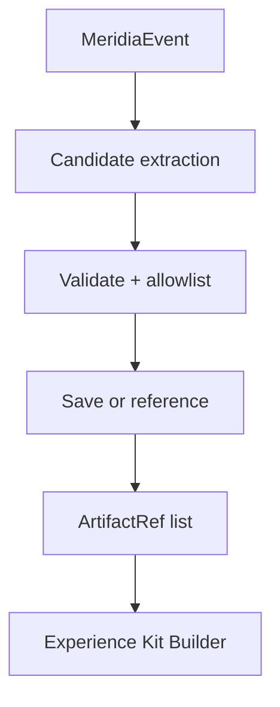

# Artifact and Reference Collector

The Artifact and Reference Collector turns an event into **durable references for more detail**, including non-text media (images/audio/video) and other citations (files, URLs).

This component is the main lever for moving Meridia from "text notes" to "captured experiences".

## What counts as an artifact

Artifacts are references to external or stored objects:

- Local files (paths + optional excerpts/diffs)
- URLs (with optional title/description)
- Media (image/audio/video) saved to disk or referenced by URL
- Derived artifacts (transcripts, OCR text, captions) stored as metadata

Meridia should use the core memory artifact shape so it can reuse existing extraction logic.

## Inputs and outputs

### Inputs

- `MeridiaEvent` (sanitized)
- `CaptureDecision.mode` (full vs light impacts how aggressively we collect)

### Outputs

```ts
export type ArtifactRef = {
  id: string;
  kind: "file" | "image" | "audio" | "video" | "link";
  uri?: string;
  mimeType?: string;
  sha256?: string;
  sizeBytes?: number;
  title?: string;
  description?: string;
  metadata?: Record<string, unknown>;
  citations?: string[];
};
```

## Collection sources

### 1. MEDIA tokens in tool output

OpenClaw already parses `MEDIA:` tokens and supports saving media. Meridia should:

- scan tool outputs and relevant texts for `MEDIA:` lines
- for each candidate, validate it is safe
- save media (or store URL as a link) and generate a stable artifact ref

### 2. Tool specific reference extraction

Tool classes that should produce references:

- filesystem write: list of files changed and a diff or excerpt reference
- outbound messaging: channel and target identifiers, message ID if available
- browser: final URL(s), page title, snapshot reference if produced
- exec: command string and stdout/stderr references (sanitized and size bounded)

### 3. Session boundary artifacts

At session end and compaction:

- session summary JSON artifact
- compaction archive artifact (episode source IDs)

## Multimodal derived text

Meridia should store derived text in artifact metadata when available:

- OCR: `artifact.metadata.ocrText`
- ASR: `artifact.metadata.transcript`
- caption: `artifact.metadata.caption`

This aligns with the core memory pipeline extractor keys and makes artifacts searchable even without embedding.

## Safety constraints

The collector must:

- never store raw image bytes inside Meridia records
- enforce strict size limits (bytes and chars)
- avoid path traversal and avoid saving unsafe local paths
- allowlist which local paths can be referenced as file artifacts

## Failure modes

| Failure            | Expected behavior                                                 |
| ------------------ | ----------------------------------------------------------------- |
| Media save fails   | store a link artifact with the original URI and an error in trace |
| Artifact too large | store link + metadata only                                        |
| URL unreachable    | store link only; do not block capture                             |

## Diagram


