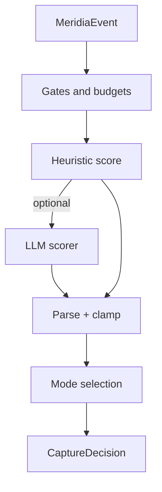

# Capture Decision Engine

This document specifies the Capture Decision Engine (CDE): the subsystem that decides **if** Meridia should capture an experience and **how much** should be captured (full, light, trace only).

The CDE is intentionally separate from:

- Phenomenology extraction (what it felt like)
- Artifact collection (references and media)
- Persistence (SQLite/Postgres)

That separation enables parallel development and makes capture predictable under budget constraints.

## Inputs and outputs

### Inputs

- `MeridiaEvent` envelope (normalized and sanitized)
- Recent capture history (for gates, budgets, and redundancy checks)
- Config (thresholds, per kind policies, tool allowlists)

### Outputs

```ts
export type CaptureDecision = {
  shouldCapture: boolean;
  significance: number; // 0..1
  mode: "full" | "light" | "trace_only";
  threshold?: number;
  reason?: string;
  limited?: { reason: "min_interval" | "max_per_hour" | "budget"; detail?: string };
};
```

## Core responsibilities

1. **Significance scoring**
   - Compute a stable 0..1 significance score.
   - Prefer monotonic signals (irreversible changes, external comms, errors, decisions).
2. **Mode selection**
   - `full`: include phenomenology + artifact collection + raw excerpts (sanitized).
   - `light`: include phenomenology only and minimal references (citations, not payloads).
   - `trace_only`: do not capture a kit; only emit trace/audit event.
3. **Gates and budgets interaction**
   - Respect min interval, max per hour, and global daily/weekly budget.
   - Provide structured reasons when capture is limited.
4. **Redundancy control**
   - Detect near duplicates (same tool name, same file, same error) and downgrade to `light` or `trace_only`.

## Decision model

The CDE should be a **hybrid model**:

- Heuristics: fast, deterministic, safe under missing model keys.
- LLM scorer (optional): improves recall for nuanced events, but must be bounded and fail safe.

### Heuristic features

Minimum useful features:

- `event.kind` and `tool.name`
- `tool.isError`
- "irreversibility hints": write operations, outbound messages, deletions, deployments
- payload size hints (large output, binary outputs)
- session boundary markers (always high)

### LLM scoring contract

LLM scoring must return a strict JSON object:

```json
{
  "significance": 0.0,
  "mode": "full",
  "reason": "short string"
}
```

Constraints:

- Timeout bounded (low seconds).
- Max tokens bounded.
- If parsing fails, fall back to heuristic.
- LLM is not allowed to request additional tools or external fetch.

## Budgets and gates (interaction)

The CDE should not implement rate limiting itself; it consumes gate output.

Recommended gates:

- `min_interval_ms` (per session)
- `max_captures_per_hour` (per session)
- `daily_token_budget` (global)
- `artifact_bytes_budget` (global)

Budget behavior:

- If budget exceeded, set `mode="trace_only"` and record `limited.reason="budget"`.
- If a session boundary event occurs, override budgets up to a small emergency allowance.

## Failure modes and expected behavior

| Failure                | Expected behavior                            |
| ---------------------- | -------------------------------------------- |
| LLM key missing        | Use heuristic only                           |
| LLM timeout            | Use heuristic only, include timeout in trace |
| Gate store unavailable | Use conservative defaults (capture less)     |
| Payload too large      | Downgrade mode and/or drop raw payload       |

## Observability

The engine should emit trace events for:

- Decision outcome (`capture`, `skip`, `error`)
- Significance score and threshold
- Gate/budget limitations
- LLM model and latency when used

Suggested metrics:

- capture rate by event kind and tool
- average significance by event kind
- percentage of LLM usage and timeouts
- percent of decisions limited by budgets

## Diagram


