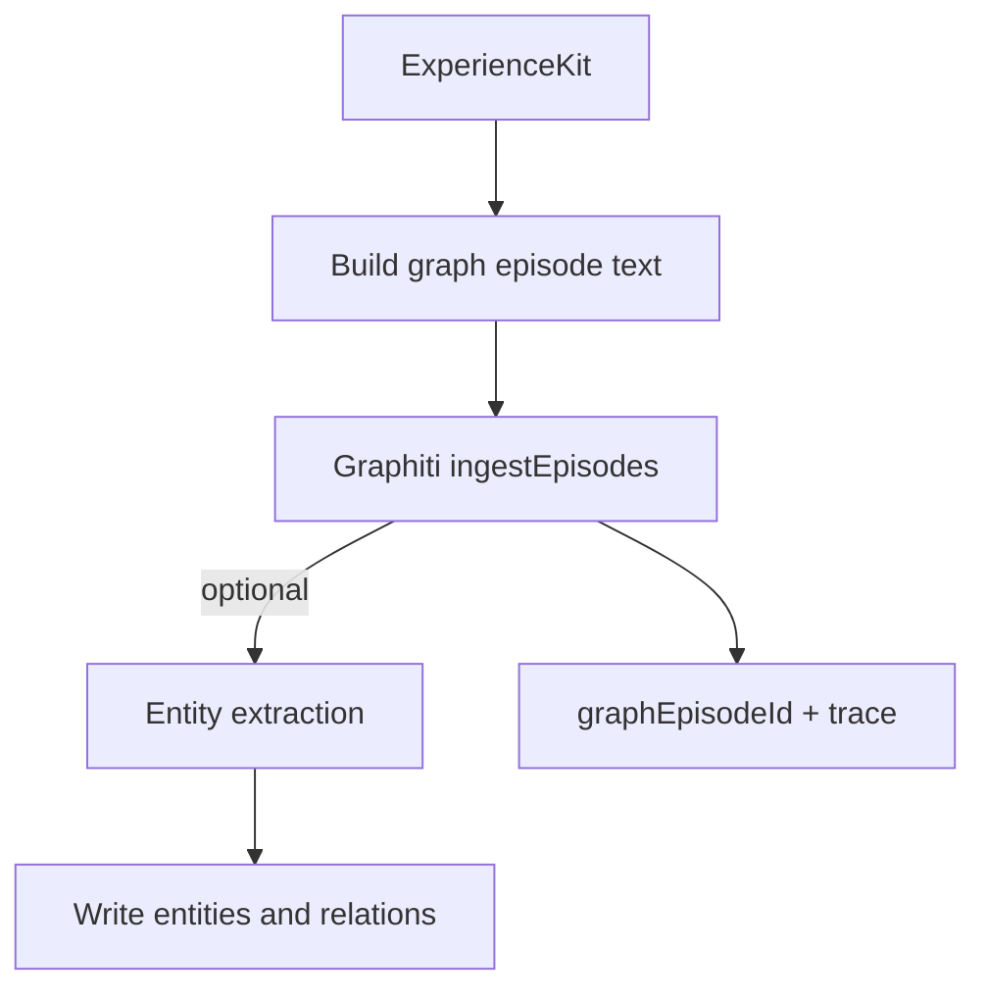

# Graph Linker (Neo4j via Graphiti)

The Graph Linker writes Meridia experiences into a graph store so retrieval can use:

- relationship traversal ("what else connects to this?")
- entity centric recall (people, projects, topics)
- causality and temporal chains

Meridia uses Graphiti as the integration surface to Neo4j.

## Inputs and outputs

### Inputs

- `ExperienceKit` (canonical record + artifacts + phenomenology)

### Outputs

- A Graphiti episode for the experience
- Optional graph entities and relations (entity extraction)
- Back references stored in `ExperienceKit.links.graphEpisodeId`

## Graph model (suggested)

At minimum, represent:

- `Experience` nodes (one per kit)
- `Artifact` nodes (file/link/media)
- `Session` nodes
- `Person` and `Topic` nodes (from entity extraction)

Edges:

- `CONTAINS`: Session -> Experience
- `REFERENCES`: Experience -> Artifact
- `INVOLVES`: Experience -> Person
- `ABOUT`: Experience -> Topic
- `FOLLOWS`: Experience -> Experience (temporal)

All edges and nodes include provenance and timestamps.

## Write strategy

1. Create an episode text that includes:
   - topic/summary
   - phenomenology anchors
   - citations to artifacts (not raw content)
2. Ingest episode via Graphiti client.
3. Optionally run entity extraction and write entities/relations.
4. Record trace events for graph write success/failure.

## Failure modes and fallbacks

| Failure                  | Expected behavior                                        |
| ------------------------ | -------------------------------------------------------- |
| Graphiti disabled        | no graph writes, canonical store remains source of truth |
| Graphiti health degraded | retry with backoff; do not block capture                 |
| entity extraction fails  | store episode only                                       |

## Diagram

