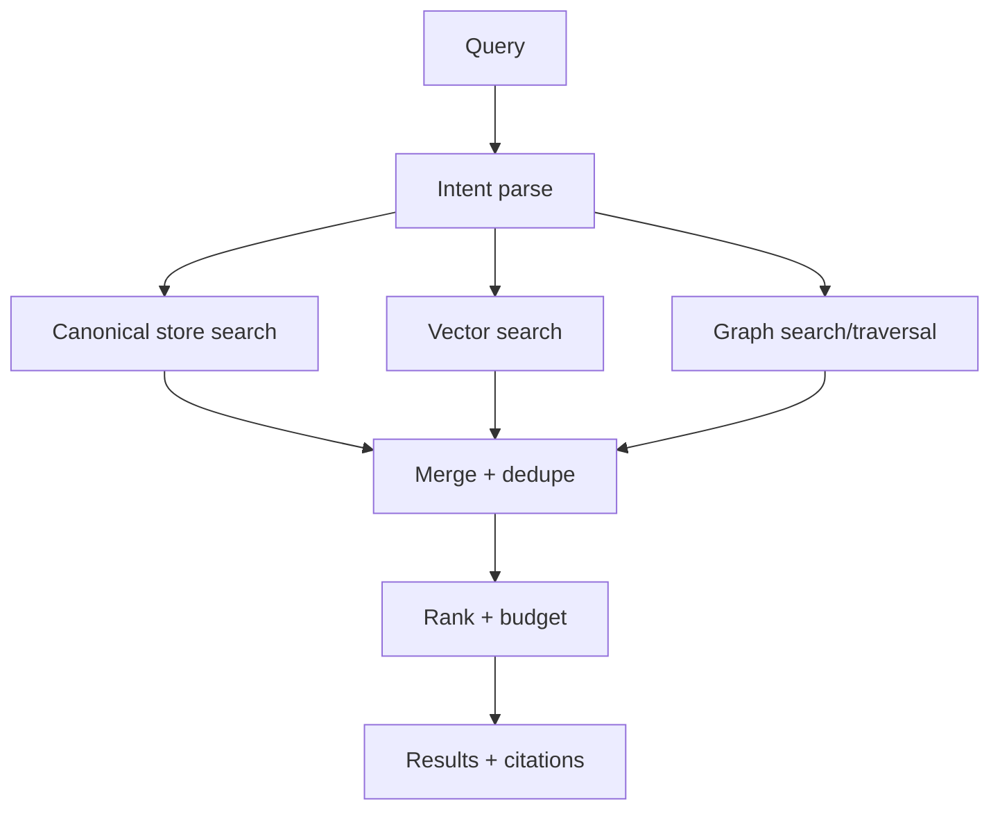

# Hybrid Retriever and Ranker

The Hybrid Retriever answers "what is relevant now?" by combining:

- Canonical store queries (filters + FTS)
- Vector similarity search (pgvector)
- Graph traversal queries (Graphiti/Neo4j)

Then it ranks, deduplicates, and emits citations suitable for reconstitution or direct answering.

## Inputs and outputs

### Inputs

- query string
- optional time hints and session constraints
- optional target: search results vs reconstitution pack

### Outputs

- ranked list of `ExperienceKit` references
- citations (meridia://, file://, http(s)://) and optionally rendered snippets

## Query intent

Intent parsing should extract:

- time windows ("last 48h", "yesterday", explicit dates)
- entity mentions (people, projects)
- experience hints ("felt like", "similar to", "when we were debugging")

This can start simple and improve over time.

## Retrieval sources

### 1. Canonical store (SQLite/Postgres)

- filter by session, tool, tags, significance
- FTS query on topic/summary/anchors/derived text

### 2. Vector index

- embed query and retrieve topK
- apply filters (time, session) in the vector query if supported

### 3. Graph store

- queryHybrid for facts/episodes
- traverse neighbors of seed entities (person/topic)

## Ranking strategy

Use a weighted scoring model:

- significance score (kit capture score)
- semantic similarity score (vector)
- graph proximity (hops, edge weights)
- recency decay
- diversity (avoid returning 10 items from same tool/session)

Ranking should also be "budget aware":

- stop early when token budget is reached
- prefer fewer high quality kits with strong anchors

## Failure modes

| Failure               | Expected behavior                                |
| --------------------- | ------------------------------------------------ |
| vector unavailable    | continue with canonical + graph                  |
| graph unavailable     | continue with canonical + vector                 |
| canonical unavailable | degrade to graph/vector, but warn and emit trace |

## Diagram

