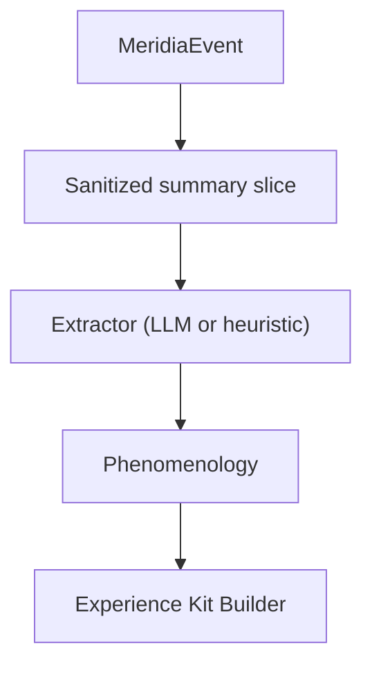

# Phenomenology Extractor

The Phenomenology Extractor produces the experiential facets that enable **reconstitution**: emotional signature, engagement quality, anchors, uncertainties, and reconstitution hints.

It should align to `docs/experiential-engine/schemas/experiential-record.schema.json` while remaining compatible with Meridia's canonical record format.

## Inputs and outputs

### Inputs

- `MeridiaEvent` (already sanitized)
- `CaptureDecision` (only run when mode is `full` or `light`)

### Outputs

```ts
export type Phenomenology = {
  emotionalSignature?: {
    primary: string[];
    secondary?: string[];
    intensity: number;
    valence?: number;
    texture?: string;
  };
  engagementQuality?: "deep-flow" | "engaged" | "routine" | "distracted" | "struggling";
  anchors?: Array<{ phrase: string; significance: string; sensoryChannel?: string }>;
  uncertainties?: string[];
  reconstitutionHints?: string[];
};
```

## Extraction strategies

### Strategy 1: LLM extraction (preferred when available)

Use a strict JSON response format. The prompt should:

- include only sanitized summaries and small excerpts
- forbid markdown
- ask for 1-3 primary emotions and intensity 0..1
- require at least 1 anchor when mode is `full`
- bias toward actionable reconstitution hints (approach guidance)

### Strategy 2: Heuristic extraction (fallback)

When LLM is unavailable:

- `emotionalSignature.primary`: infer from event class (error -> "uncertain" / "frustrated", external comms -> "attentive", etc) but keep conservative.
- `engagementQuality`: infer from event type (session boundary -> "engaged") or omit.
- anchors: derive from salient phrases (tool name, file path, error first line).
- uncertainties: include error/unknown markers.
- hints: include a single generic hint (eg "re-read the artifacts and resume from the last decision").

## Anchors and why they matter

Anchors are the bridge between:

- "knowing what happened" and
- "approaching the state again"

They should be:

- concrete
- short
- tied to a sensory/conceptual channel (verbal, visual, conceptual, relational)

## Relationship to artifact collection

Phenomenology should reference artifacts via citations, but must not depend on artifacts being saved successfully. Treat artifacts as optional enrichment.

## Failure modes

| Failure                          | Expected behavior                                                       |
| -------------------------------- | ----------------------------------------------------------------------- |
| LLM returns invalid JSON         | fall back to heuristic phenom                                           |
| Not enough context               | emit minimal phenom with 1 anchor                                       |
| Event contains sensitive content | extractor must never reintroduce raw secrets; stick to abstract anchors |

## Diagram


