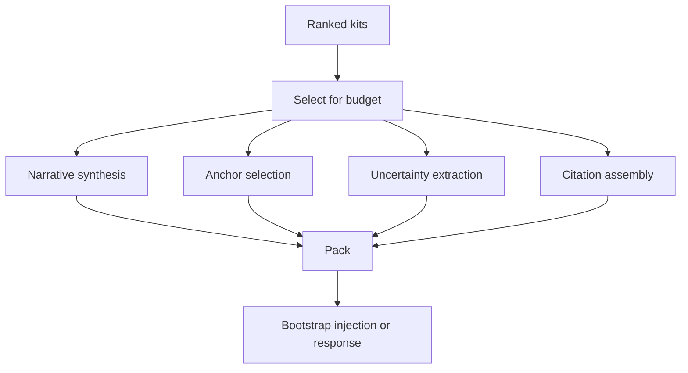

# Reconstitution Engine

The Reconstitution Engine converts ranked experience kits into a **state approach context pack**.

This is not "a list of what happened". It is guidance that helps the agent:

- regain situational continuity
- re-enter the collaboration posture
- preserve open uncertainties and next actions

## Inputs and outputs

### Inputs

- ranked experience kits (with phenomenology and artifacts)
- current session context (channel, user identity if known, goals)
- token budget

### Output

```ts
export type ReconstitutionPack = {
  summary: string;
  approachGuidance: string[];
  anchors: Array<{ phrase: string; instruction: string; citation?: string }>;
  openUncertainties: string[];
  nextActions: string[];
  citations: Array<{ id: string; kind: string; uri?: string; citation: string }>;
};
```

## Pack structure (recommended)

1. Short narrative summary (1-3 paragraphs)
2. "Approach guidance" (how to engage, what to prioritize)
3. Anchors (verbal/visual/conceptual/relational)
4. Open uncertainties and what would resolve them
5. Next actions (concrete)
6. Citations and references (meridia:// + artifacts)

## Personalization and relationship continuity

If the query intent or session context indicates a specific relationship or channel, the pack should:

- surface relationship anchors first
- include "what to avoid" if known
- bias toward recent high significance relational kits

## Budgeting

The engine must be token budget aware:

- include at most N kits
- prefer kits with strong anchors and reconstitution hints
- keep citations compact but stable

## Failure modes

| Failure                   | Expected behavior                                        |
| ------------------------- | -------------------------------------------------------- |
| missing phenomenology     | fall back to topic/summary + a generic approach guidance |
| missing artifacts         | keep meridia:// citations                                |
| retrieval returns nothing | emit a minimal "no continuity data available" pack       |

## Diagram


