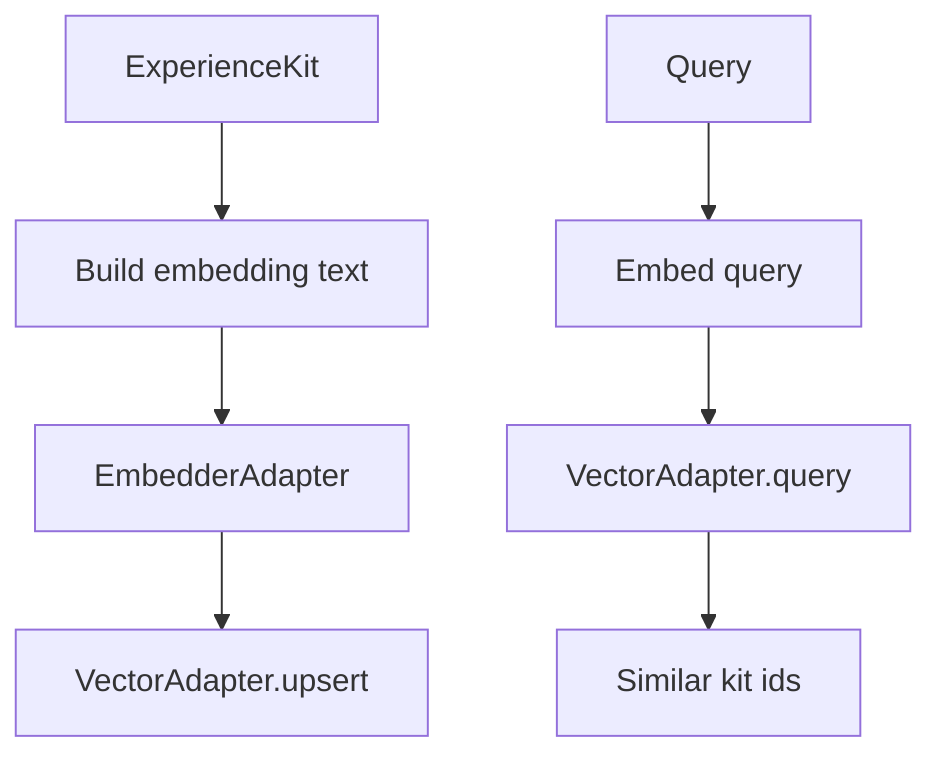

# Vector Index (pgvector)

The Vector Index enables semantic similarity queries:

- "find experiences that felt like this"
- "retrieve experiences related in meaning even without shared keywords"
- clustering support for compaction

Meridia should prefer pgvector so structured filters and vectors live close together.

## Inputs and outputs

### Inputs

- `ExperienceKit` (topic, summary, anchors, derived artifact text)

### Outputs

- One or more vector records keyed by:
  - kit id (primary)
  - optional derived episode ids (artifact derived text)

## Embedding materialization

Create a deterministic "embedding text" for each kit:

- topic and summary
- phenomenology (emotional signature, engagement quality)
- anchors (phrases only)
- uncertainties (short)
- reconstitution hints (short)
- derived artifact text (OCR/ASR/captions) within budget

This avoids embedding raw secrets and keeps vectors stable.

## Index and query API

Vector adapter contract (core shape):

```ts
export interface VectorAdapter {
  upsert(
    records: Array<{ id: string; values: number[]; metadata?: Record<string, unknown> }>,
  ): Promise<void>;
  query(query: { vector: number[]; topK: number; filter?: Record<string, unknown> }): Promise<{
    matches: Array<{ id: string; score: number; metadata?: Record<string, unknown> }>;
  }>;
}
```

Meridia should implement:

- upsert on capture (async fanout)
- query during hybrid retrieval

## Failure modes

| Failure                    | Expected behavior                                               |
| -------------------------- | --------------------------------------------------------------- |
| vector adapter missing     | skip vector stage, hybrid retrieval degrades to lexical + graph |
| embedding provider missing | skip vector stage                                               |
| index write failure        | retry asynchronously; never block capture                       |

## Diagram


