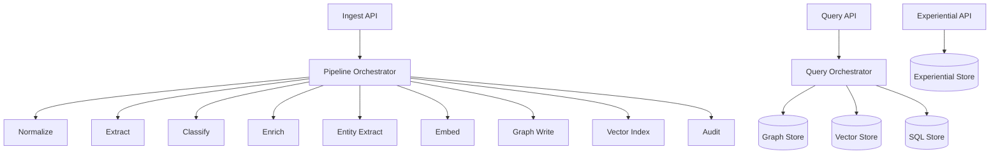

# MemClawd Memory Composition Service

MemClawd is the standalone async memory pipeline extracted from the embedded clawdbot memory system. It exposes ingestion, query, and experiential endpoints while coordinating storage backends for graph, vector, and relational memory.

## Quickstart

```bash
pnpm --dir memclawd install
pnpm --dir memclawd dev
```

Local development stack (Redis + Postgres/pgvector + Neo4j):

```bash
pnpm --dir memclawd docker:dev
```

## Architecture



## Project Layout

- `src/api` — HTTP server and route handlers
- `src/contracts` — shared contracts for ingestion, query, and entities
- `src/pipeline` — ingestion pipeline orchestration
- `src/storage` — adapter interfaces for memory backends
- `src/experiential` — experiential schemas and capture utilities
- `docker` — local dev stack
- `docs/usage-examples.md` — client and curl usage samples
