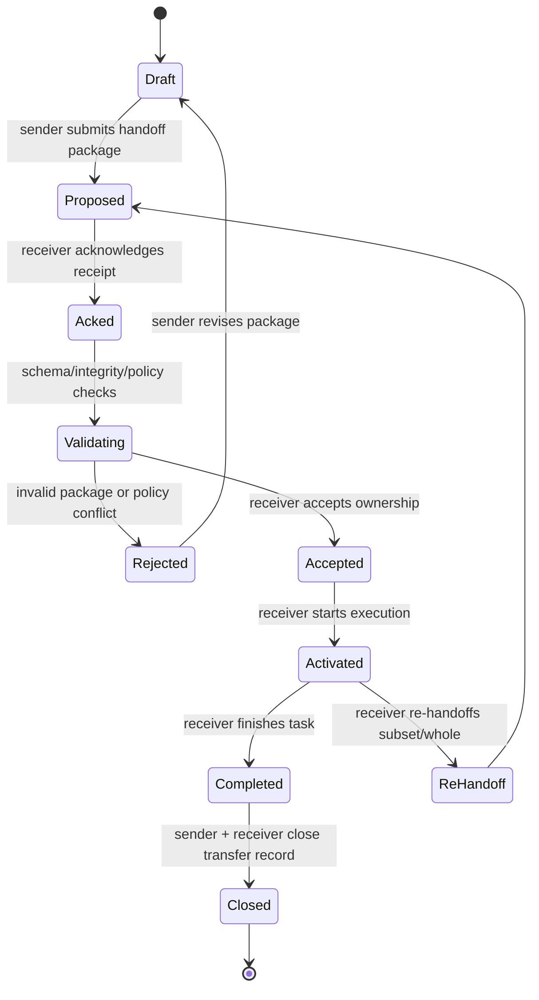
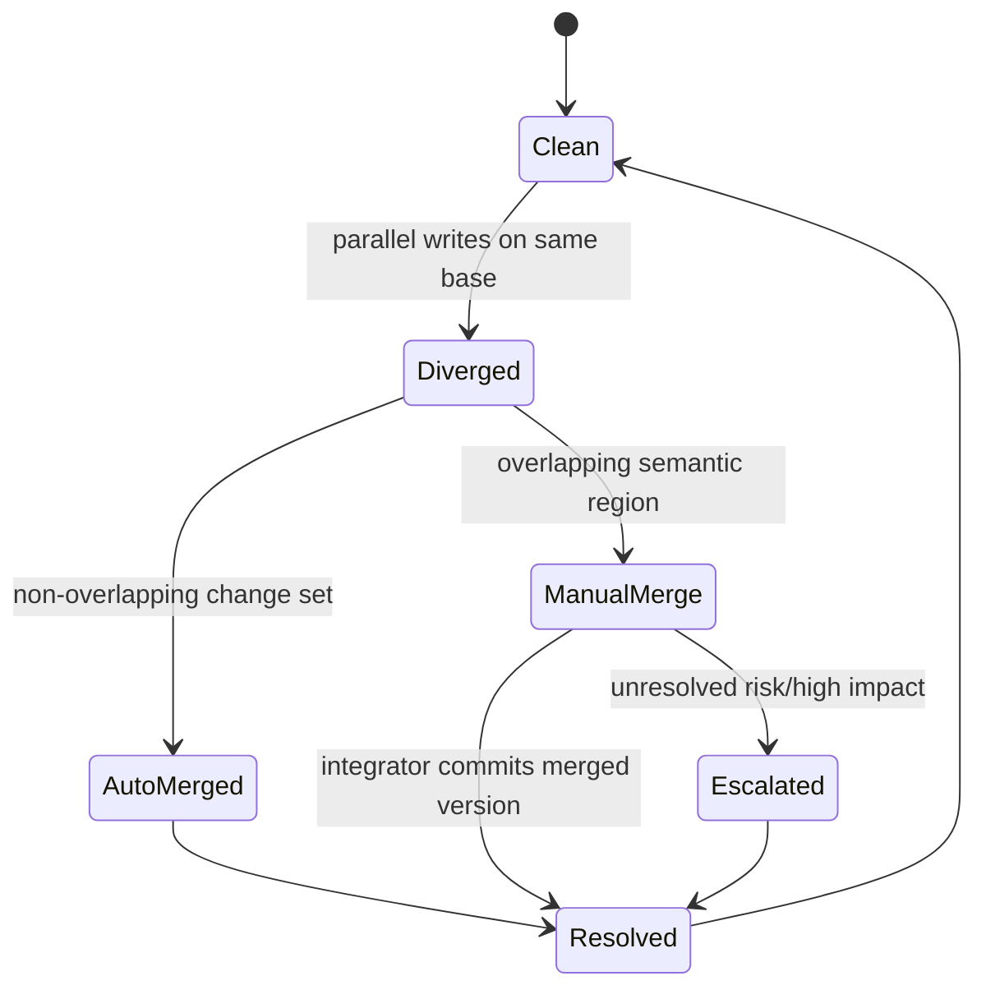
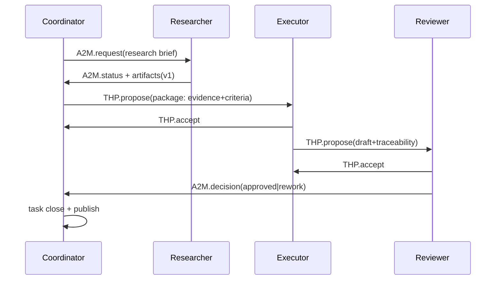
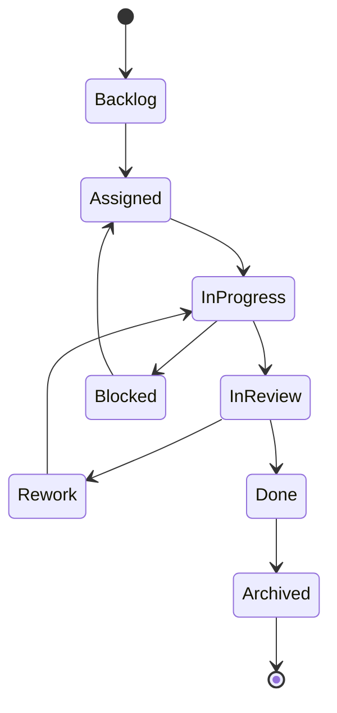
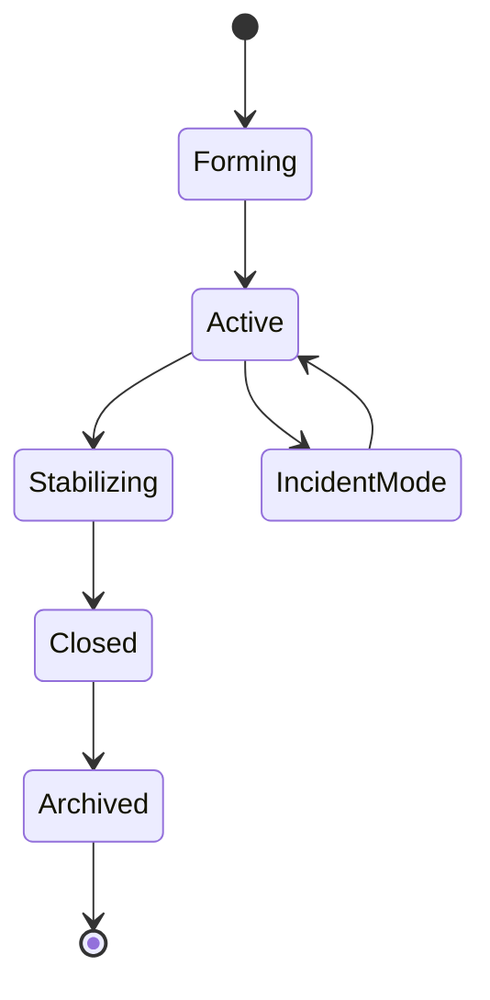

# OpenClaw Spec: Structured Agent Handoffs, Inter-Agent Communication, and Multi-Agent Teamspaces

**File:** `/Users/openclaw/.openclaw/workspace/tim/agent-handoff-teamspace-spec-2026-02-21.md`  
**Date:** 2026-02-21 (MST)  
**Author:** Tim (VP Architecture)  
**Requested by:** David (CEO)  
**Inputs:**
- Tim Idea #10 in `/Users/openclaw/.openclaw/workspace/tim/brainstorm-roadmap-2026-02-21.md`
- Amadeus Idea #8 in `/Users/openclaw/.openclaw/workspace/amadeus/brainstorm-roadmap-2026-02-21.md`

---

## 1) Executive Summary

This spec defines a **layered, minimally invasive architecture** for:
1. Structured handoff protocols between agents
2. Persistent multi-agent teamspaces (roles, shared context, artifacts, versioning)
3. Reusable coordination patterns for common workflows
4. A phased rollout path that sits mostly on top of existing OpenClaw primitives

### Key design principle
Per Amadeus’s recommendation (Idea #8): start with a **simple structured directed message primitive**, then add negotiation semantics, then add stronger orchestration.

### Core proposal
Introduce an **Agent Coordination Layer (ACL)** with three protocol families:
- **A2M (Agent-to-Agent Messaging)** — request/response/broadcast envelope with strict schemas
- **THP (Task Handoff Protocol)** — explicit transfer of ownership + context + artifacts + verification
- **TSP (Teamspace Protocol)** — persistent shared state for roles, tasks, artifacts, decisions, and conflicts

All three can ship in phases using existing infrastructure:
- sessions + session IDs
- spawn/sub-agent hierarchy
- workspace files
- message channels
- existing session visibility (`sessions_history`, session lineage)

---

## 2) Problem Statement

Today, multi-agent collaboration is possible but implicit:
- Coordination is ad hoc (files, prompts, manual orchestration)
- Handoffs are not consistently structured or auditable
- Shared artifacts can drift without explicit version contracts
- Role transitions are mostly social/conventional, not protocolized

This causes three failure classes:
1. **Context loss** during handoff (missing assumptions, missing constraints)
2. **Coordination ambiguity** (who owns what now, and by when?)
3. **Merge/conflict chaos** in parallel work

We need explicit protocol contracts while preserving OpenClaw’s existing architecture and shipping speed.

---

## 3) Design Goals and Non-Goals

## Goals
1. **Safe handoffs**: transfer state, constraints, partial work, and artifacts with integrity checks.
2. **Transparent collaboration**: every meaningful transfer is auditable and reviewable.
3. **Role-aware teamspaces**: persistent shared context with explicit ownership and rotation.
4. **Conflict-tolerant artifacts**: deterministic versioning + merge + escalation paths.
5. **Minimal invasiveness**: additive layer over current sessions/messaging/workspaces/spawn.
6. **Human oversight points**: policy gates for sensitive transitions/actions.

## Non-goals (Phase 1)
1. Full autonomous market-style negotiation across all agents.
2. Deep core runtime rewrite.
3. CRDT-heavy real-time collaborative editing in core.
4. Elimination of hierarchical spawning (we keep it; we add peer coordination overlays).

---

## 4) Existing OpenClaw Primitives to Reuse (Minimal Invasiveness Baseline)

This design intentionally builds on existing capabilities:

1. **Session primitives**
   - Session IDs as canonical actor/run identities
   - Session lineage for parent/sub-agent chains
2. **Sub-agent infrastructure**
   - `sessions_spawn` as ownership delegation primitive
   - `subagents` visibility for active task graph awareness
3. **Workspace filesystem**
   - Durable coordination store (manifests, ledgers, artifacts, logs)
4. **Messaging surfaces**
   - Existing message channel integrations for human visibility/escalation
5. **Session history**
   - Pullable execution evidence and provenance

### Architectural stance
- **Phase 1:** mostly conventions + extension tools + file-backed records
- **Phase 2:** optional lightweight core hooks (event emission)
- **Phase 3:** optional richer orchestration service

---

## 5) Protocol Stack Overview

```text
Layer 4: Workflow Patterns (research→draft→review, debug swarm, parallel merge)
Layer 3: Teamspace Protocol (TSP) — roles/tasks/artifacts/decisions/conflicts
Layer 2: Task Handoff Protocol (THP) — transfer ownership/state/artifacts
Layer 1: Agent-to-Agent Messaging (A2M) — typed request/response/broadcast envelope
Layer 0: Existing OpenClaw primitives (sessions, spawn, workspace, messaging)
```

### Protocol IDs
- `a2m.v1`
- `thp.v1`
- `tsp.v1`

---

## 6) A2M v1 — Structured Agent-to-Agent Messaging Protocol

This is the foundational primitive (aligned to Amadeus Idea #8).

## 6.1 Envelope schema

```json
{
  "protocol": "a2m.v1",
  "message_id": "uuid",
  "thread_id": "uuid",
  "sent_at": "2026-02-21T17:32:12Z",
  "from": {
    "agent_id": "tim",
    "session_id": "agent:tim:subagent:..."
  },
  "to": {
    "agent_id": "claire",
    "session_id": "agent:claire:subagent:...",
    "scope": "direct"
  },
  "type": "request|offer|accept|decline|counter|status|blocker|knowledge|decision|escalation|close",
  "topic": "debug/auth-timeout",
  "urgency": "low|normal|high|critical",
  "ttl_seconds": 1800,
  "requires_ack": true,
  "in_reply_to": "message_id|null",
  "payload": {},
  "attachments": [
    {
      "kind": "artifact|log|diff|decision",
      "uri": "teamspace://ts-auth/artifacts/a-102",
      "sha256": "...",
      "size_bytes": 18291
    }
  ],
  "policy": {
    "visibility": "team|private|human-audit",
    "sensitivity": "low|moderate|high",
    "human_gate": "none|required"
  }
}
```

## 6.2 Message types (minimum set)
- `request`: asks another agent to do bounded work
- `offer`: advertises available capacity/capability for work
- `accept/decline/counter`: explicit negotiation response
- `status`: progress update with percent + ETA
- `blocker`: cannot continue without dependency
- `knowledge`: push discovery to relevant peers
- `decision`: proposes or confirms design/process decision
- `escalation`: asks higher-role/human intervention
- `close`: closes thread with outcome + links

## 6.3 Safety controls
1. **TTL + dead-letter handling** for unacked messages
2. **Rate limits** per sender, topic, and urgency band
3. **Loop guards** using `thread_id` + max hop count
4. **Audit log** for all critical/high sensitivity messages
5. **Human visibility policy** for escalation/critical paths

---

## 7) THP v1 — Task Handoff Protocol (Detailed)

THP governs ownership transfer of task execution between agents.

## 7.1 Handoff contract model

A handoff is valid only if all required phases complete:
1. **Propose** handoff with package metadata
2. **Acknowledge intent** to evaluate
3. **Validate package** (schema, integrity, policy)
4. **Accept ownership** (or reject with reasons)
5. **Activate execution** under new owner
6. **Close transfer** with source marking released

No silent handoffs. No ambiguous ownership.

## 7.2 Handoff package schema

```json
{
  "protocol": "thp.v1",
  "handoff_id": "uuid",
  "task": {
    "task_id": "T-2026-02-21-041",
    "title": "Finalize OAuth timeout root cause + patch plan",
    "objective": "Deliver verified root cause and minimally invasive patch",
    "success_criteria": [
      "Repro confirmed",
      "Root cause identified",
      "Patch diff prepared",
      "Risk assessment documented"
    ],
    "deadline": "2026-02-22T01:00:00Z",
    "priority": "high"
  },
  "context": {
    "summary": "2-paragraph state summary",
    "constraints": ["No core refactor", "Additive hooks only"],
    "assumptions": ["Gateway v3 protocol unchanged"],
    "open_questions": ["Token refresh race or stale nonce?"],
    "known_risks": ["Intermittent repro can mask fix quality"]
  },
  "work_state": {
    "status": "in_progress",
    "percent_complete": 55,
    "completed_steps": ["Captured repro logs", "Narrowed suspect modules"],
    "next_step": "Instrument refresh path around nonce validation"
  },
  "artifacts": [
    {
      "artifact_id": "A-11",
      "path": "/Users/openclaw/.openclaw/workspace/_shared/teamspaces/ts-auth/artifacts/logs/repro-20260221.log",
      "kind": "log",
      "version": "3",
      "sha256": "...",
      "required": true
    }
  ],
  "provenance": {
    "origin_session": "agent:tim:subagent:...",
    "related_sessions": ["agent:claire:subagent:..."],
    "decision_refs": ["D-19", "D-20"],
    "message_thread_refs": ["thread-uuid"]
  },
  "policy": {
    "classification": "internal",
    "requires_human_approval": false,
    "export_restrictions": ["no_external_channel_post"]
  },
  "verification": {
    "schema_version": "1.0",
    "package_hash": "sha256(...)",
    "signed_by": "tim"
  }
}
```

## 7.3 Handoff state machine



## 7.4 Required checks before `Accepted`
1. Schema validation success
2. Required artifacts resolvable and hash-matching
3. Policy checks pass (security/compliance/human gate)
4. Receiver role/capability match (or explicit override)
5. Single-owner lock acquired for task execution scope

## 7.5 Rejection contract (no silent fail)
If rejected, receiver returns machine-readable reasons:
- `missing_artifact`
- `hash_mismatch`
- `policy_violation`
- `capacity_unavailable`
- `capability_mismatch`
- `unclear_success_criteria`

## 7.6 Transparency and audit
Each transition appends to immutable handoff journal:
- timestamp
- actor
- event
- reason
- linked evidence URI(s)

---

## 8) TSP v1 — Teamspace Architecture

A Teamspace is the persistent shared operating context for a multi-agent mission.

## 8.1 Teamspace object model

A teamspace contains:
1. **Manifest**: purpose, scope, policies
2. **Role ledger**: role assignments and rotation history
3. **Task board**: tasks, owners, state, dependencies
4. **Artifact registry**: content-addressed records + versions
5. **Decision log**: ADR-like records
6. **Handoff journal**: all THP events
7. **Coordination inbox/outbox**: A2M messages by thread

## 8.2 File/Storage layout (Phase 1 friendly)

```text
/Users/openclaw/.openclaw/workspace/_shared/teamspaces/<teamspace_id>/
  teamspace.manifest.json
  roles/ledger.jsonl
  tasks/tasks.jsonl
  handoffs/handoffs.jsonl
  messages/messages.jsonl
  artifacts/
    registry.jsonl
    <artifact-group>/<artifact-name>__vNN.ext
  decisions/decisions.jsonl
  conflicts/conflicts.jsonl
  snapshots/
    snapshot-<timestamp>.json
```

This is intentionally file-first and append-only friendly.

## 8.3 Teamspace manifest schema

```json
{
  "protocol": "tsp.v1",
  "teamspace_id": "ts-auth-hardening",
  "name": "Auth Hardening Tiger Team",
  "objective": "Stabilize OAuth + nonce reliability",
  "created_at": "2026-02-21T17:00:00Z",
  "created_by": "xavier",
  "lifecycle": "forming|active|stabilizing|closed|archived",
  "policy": {
    "default_visibility": "team",
    "human_gate_actions": ["external_message", "prod_command"],
    "max_parallel_tasks": 6
  },
  "roles": ["coordinator", "researcher", "executor", "reviewer", "integrator"],
  "artifact_strategy": "versioned-append",
  "conflict_strategy": "optimistic-lock+3way-merge+escalation"
}
```

---

## 9) Roles: Assignment, Rotation, and Authority

## 9.1 Canonical roles
- **Coordinator**: planning, assignment, escalations
- **Researcher**: gathers evidence/options
- **Executor**: implements bounded tasks
- **Reviewer**: checks quality/policy/risk
- **Integrator**: merges parallel outputs

## 9.2 Role authority matrix (summary)
- Coordinator can create tasks, approve handoffs, trigger escalations
- Executor can claim execution tasks but cannot self-approve closure for high-risk classes
- Reviewer can block/return work with explicit reason code
- Integrator owns merge decisions and final artifact lineage closure

## 9.3 Rotation protocol
Role rotation is explicit event `role.rotate`:
- Requires outgoing + incoming ack
- Includes handoff package for role backlog
- Updates role ledger with reason (`load_balance`, `coverage`, `handoff`, `incident`)

Rotation triggers:
- Time-based shift windows
- Capacity thresholds
- Incident response mode
- Conflict-of-interest guard (reviewer ≠ original executor for guarded tasks)

---

## 10) Artifact Versioning and Conflict Resolution

## 10.1 Artifact identity
Each artifact gets:
- `artifact_id` (stable logical identity)
- `version` (monotonic integer)
- `content_hash`
- `parent_version` (for lineage)
- `author`, `timestamp`, `change_note`

## 10.2 Write model
- **Optimistic concurrency** by default
- Writer must specify expected parent version
- If parent mismatch: write rejected with `version_conflict`

## 10.3 Conflict handling states



## 10.4 Merge policy
1. Attempt structural 3-way merge
2. If semantic overlap, require Integrator decision
3. For high sensitivity artifacts, require Reviewer signoff
4. Preserve all branches in lineage; no silent overwrite

---

## 11) Coordination Patterns (Reusable Workflow Blueprints)

## 11.1 Pattern A: Research → Draft → Review

### Flow
1. Coordinator opens task + success criteria
2. Researcher produces evidence bundle artifact set
3. Handoff (THP) to Drafter/Executor
4. Executor creates draft output + trace links
5. Handoff to Reviewer with checklist
6. Reviewer approves or returns with reason codes
7. Integrator publishes final artifact and closes task

### State model
`new -> researching -> drafting -> reviewing -> approved|rework -> published`

### Failure handling
- Missing evidence => return `insufficient_context`
- Policy failure => escalation + human gate
- Deadline risk => coordinator reassigns with partial package

### Sequence diagram



---

## 11.2 Pattern B: Debugging Collaboration (Swarm with Coordinator)

### Flow
1. Coordinator defines failing symptom and guardrails
2. Parallel hypotheses assigned to multiple Executors
3. Each branch writes hypothesis artifacts
4. Integrator compares findings and converges root cause
5. Reviewer validates fix plan vs evidence
6. Coordinator chooses implementation path

### Key protocol elements
- Topic-scoped A2M threads per hypothesis
- THP for branch ownership changes
- Artifact registry for logs/traces/repro scripts
- Decision log for hypothesis kill/keep rationale

### Conflict guard
Only Integrator can mark root cause as canonical unless emergency override.

---

## 11.3 Pattern C: Parallel Work + Merge

### Flow
1. Coordinator shards task into independent work packets
2. Each packet assigned by THP with explicit boundaries
3. Executors produce artifacts against packet scopes
4. Integrator runs merge plan + conflict checks
5. Reviewer validates merged result integrity
6. Final close + retrospective notes

### Required packet fields
- `scope_in` / `scope_out`
- dependency list
- merge contract
- acceptance tests

### Merge readiness checklist
- all packet tasks completed/closed
- no unresolved conflict events
- artifact versions linked to merged output
- reviewer signoff complete

---

## 12) End-to-End Handoff Safety and Transparency Model

## 12.1 Integrity
- Content hash on every required artifact
- Package hash over entire THP payload
- Reject on mismatch

## 12.2 Traceability
- Every message, handoff, decision has stable ID
- Cross-links between message thread IDs, task IDs, artifact IDs

## 12.3 Oversight
- Policy can require human gate on:
  - external communication
  - production-impacting steps
  - high-sensitivity data transitions

## 12.4 Explainability
Every closure event includes:
- what changed
- why it changed
- what evidence supports it
- what risk remains

---

## 13) Minimal-Invasiveness Integration Plan

## 13.1 Phase 1 (No core refactor): Convention + Extension layer

### What ships
1. Teamspace filesystem schema (append-only JSONL + artifacts dir)
2. Protocol validators (A2M/THP/TSP JSON schemas)
3. Helper tools (as extension) e.g.:
   - `teamspace_create`
   - `teamspace_task_open`
   - `teamspace_handoff_propose`
   - `teamspace_handoff_accept`
   - `teamspace_artifact_put`
   - `teamspace_conflict_resolve`
4. Human-readable markdown summaries for #cb-inbox posts

### Why minimal
- Uses existing workspace durability
- Uses current spawn/session model for execution ownership
- Requires no mandatory runtime rewrite

## 13.2 Phase 2 (Light hooks, still additive)

Add small core hook emissions (or equivalent extension-observable events):
- `session.started`
- `subagent.spawned`
- `session.completed`
- `message.sent` (internal agent thread)

These make observability and auto-journaling robust, but remain low blast radius.

## 13.3 Phase 3 (Optional service hardening)

Introduce optional coordination service for:
- richer query/index
- policy evaluation at scale
- advanced routing/reputation integration

Still keep file-based export for portability and audit.

---

## 14) State Transition Diagrams (System-Level)

## 14.1 Task lifecycle within teamspace



## 14.2 Teamspace lifecycle



---

## 15) Dependency Analysis

## 15.1 Dependency matrix

| Dependency | Needed For | Type | Phase | Risk if Missing | Mitigation |
|---|---|---|---|---|---|
| Session identity/lineage | provenance, ownership | existing | P1 | ambiguous accountability | enforce session_id in all envelopes |
| Spawn/sub-agent infra | delegation mechanics | existing | P1 | no scalable decomposition | fallback to coordinator-only flow |
| Workspace durability | teamspace persistence | existing | P1 | state loss/inconsistency | append-only log + snapshots |
| Internal message routing primitive | A2M transport | partial | P1/P2 | low-latency negotiation limited | file-backed inbox as interim transport |
| Schema validation runtime | protocol correctness | new additive | P1 | malformed handoffs | strict validators + rejection codes |
| Policy engine hooks | human gate enforcement | partial | P2 | unsafe autonomy | explicit manual approval checkpoints |
| Observability events | debugging/audit quality | partial | P2 | weak diagnostics | periodic snapshots + journal scrapes |
| Role/capability registry | smart assignment | future | P3 | poor routing quality | static role maps in manifest |

## 15.2 Critical path
1. Define schemas (A2M/THP/TSP)
2. Implement file-backed teamspace + validators
3. Add handoff tooling + ownership locks
4. Add conflict/merge tooling
5. Add policy + observability hooks

---

## 16) Example End-to-End Flow (Concrete)

### Scenario
Research agent hands off to draft agent, then reviewer, in a teamspace.

1. Coordinator creates teamspace `ts-roadmap-q2`
2. Researcher receives `A2M.request(topic=roadmap-analysis)`
3. Researcher deposits artifacts v1-v3 (sources, summaries)
4. Researcher initiates `THP.propose` to drafter with:
   - success criteria
   - evidence links
   - unresolved questions
5. Drafter validates package, `THP.accept`, produces draft artifact v4
6. Drafter handoffs to reviewer with checklist
7. Reviewer returns `A2M.decision(rework)` citing two missing citations
8. Drafter updates artifact v5, re-handoff
9. Reviewer approves, coordinator closes task and publishes final
10. Teamspace snapshot archived

Everything is auditable and replayable via IDs + journals.

---

## 17) Security, Compliance, and Safety Posture

1. **Least-privilege role policy** in teamspace manifest
2. **Sensitivity labels** propagated through handoff package and artifacts
3. **No silent externalization**: exports to external channels require policy pass/human gate
4. **Tamper evidence**: hash chain for critical logs optional in P2+
5. **Redaction hooks** for high-sensitivity artifacts before sharing

---

## 18) Operational Metrics (What to Measure)

## 18.1 Handoff quality metrics
- handoff acceptance rate
- rejection reason distribution
- mean time to handoff acceptance
- context completeness score (required fields present)

## 18.2 Teamspace performance
- task cycle time by workflow pattern
- conflict rate and merge resolution latency
- role utilization and rotation frequency
- blocker aging

## 18.3 Safety/oversight
- number of human-gated actions
- policy violations prevented
- audit completeness score

These metrics are required to evolve from protocol correctness to protocol effectiveness.

---

## 19) Phasing Plan (Delivery)

## Phase 0 (1 week): Spec + schema freeze
- finalize A2M/THP/TSP schemas
- produce reference examples + validation tests

## Phase 1 (2-3 weeks): Teamspace MVP (no core changes)
- file-based teamspace store + append-only journals
- basic tooling for create/task/handoff/artifact
- implement 3 workflow blueprints
- manual policy checkpoints

## Phase 2 (2-4 weeks): Reliability hardening
- lightweight runtime hooks for auto-journaling
- conflict resolver improvements
- stronger rejection diagnostics
- dashboard-ready exports

## Phase 3 (4+ weeks): Scale-up enhancements
- richer routing/role matching
- negotiation expansion (counteroffers, market-based load balancing)
- integration with reputation/trust and observability plane

---

## 20) Implementation Boundary (What Must Not Happen)

To keep invasiveness low:
1. No full rewrite of session manager
2. No mandatory migration away from workspace file model
3. No removal of spawn hierarchy
4. No speculative broad refactors across unrelated modules

Additive extension-first path is mandatory.

---

## 21) Open Questions for David/Xavier/Amadeus Alignment

1. Should peer-to-peer agent routing be direct or always coordinator-mediated initially?
2. What classes of actions always require human gates in Phase 1?
3. Do we want teamspace storage only local at first, or optional cloud sync pilot?
4. Should conflict resolution policy default to integrator authority or reviewer veto?
5. What minimum observability UI is required before broad rollout?

---

## 22) Recommendation

Ship this as a **three-layer additive program**:
1. **A2M primitive first** (structured communication)
2. **THP second** (safe handoffs)
3. **TSP teamspace scaffolding third** (persistent collaboration)

This sequencing matches Amadeus’s guidance, preserves OpenClaw’s current architecture, and provides immediate practical value while creating a clean runway for richer autonomy later.

---

## Appendix A: Minimal reason codes

### Handoff rejection codes
- `missing_artifact`
- `hash_mismatch`
- `schema_invalid`
- `policy_violation`
- `capacity_unavailable`
- `capability_mismatch`
- `success_criteria_ambiguous`

### Conflict resolution codes
- `auto_merged`
- `manual_merge_required`
- `manual_merge_completed`
- `escalated_to_reviewer`
- `escalated_to_human`

---

## Appendix B: Example A2M request payload (debug assist)

```json
{
  "request_type": "debug_assist",
  "problem_statement": "Intermittent token refresh timeout under load",
  "deliverable": "Root cause hypothesis ranked with evidence",
  "acceptance_tests": [
    "Repro steps documented",
    "At least 2 hypotheses tested",
    "One disproven hypothesis logged"
  ],
  "timebox_minutes": 45
}
```

---

## Appendix C: Example Teamspace decision record

```json
{
  "decision_id": "D-2026-02-21-07",
  "title": "Adopt optimistic lock + 3-way merge for artifacts",
  "status": "accepted",
  "deciders": ["tim", "claire"],
  "context_refs": ["T-41", "conflict-12"],
  "rationale": "Minimal complexity with deterministic behavior",
  "consequences": [
    "Integrators must exist for high-parallel workflows",
    "Some semantic merges need manual review"
  ],
  "timestamp": "2026-02-21T18:10:00Z"
}
```
